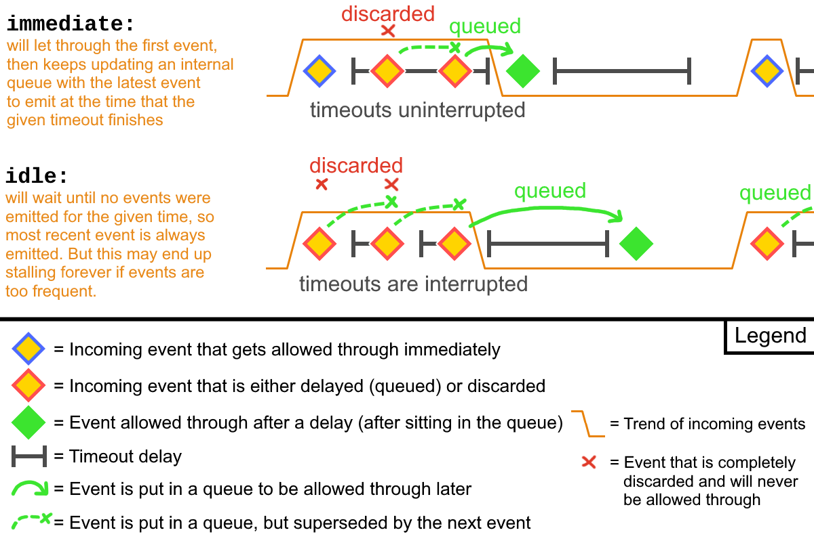

# UserUtils Documentation

<br>

<!-- #region Preamble -->
## Preamble:
This library is written in TypeScript and contains builtin TypeScript declarations, but it will also work in plain JavaScript after removing the `: type` annotations.  
  
Each feature has example code that can be expanded by clicking on the text "Example - click to view".  
The signatures and examples are written in TypeScript and use ESM import syntax to show you which types need to be provided and will be returned.  
The library itself supports importing an ESM, CommonJS or global variable definition bundle, depending on your use case.  
  
If the signature section contains multiple signatures of the function, each occurrence represents an overload and you can choose which one you want to use.  
They will also be further explained in the description below that section.  
  
Some features require the `@run-at` or `@grant` directives to be tweaked in the userscript header or have other specific requirements and limitations.  
Those will be listed in a section marked by a warning emoji (⚠️) each.  
  
If you need help with something, please [create a new discussion](https://github.com/Sv443-Network/UserUtils/discussions) or [join my Discord server.](https://dc.sv443.net/)  
For submitting bug reports or feature requests, please use the [GitHub issue tracker.](https://github.com/Sv443-Network/UserUtils/issues)

<br>

<!-- #region Features -->
## Table of Contents:
- [**Preamble** (info about the documentation)](#preamble)
- [**Features**](#features)
  - [**DOM:**](#dom)
    - [`SelectorObserver`](#selectorobserver) - class that manages listeners that are called when selectors are found in the DOM
    - [`getUnsafeWindow()`](#getunsafewindow) - get the unsafeWindow object or fall back to the regular window object
    - [`isDomLoaded()`](#isdomloaded) - check if the DOM has finished loading and can be queried and modified
    - [`onDomLoad()`](#ondomload) - run a function or pause async execution until the DOM has finished loading (or immediately if DOM is already loaded)
    - [`addParent()`](#addparent) - add a parent element around another element
    - [`addGlobalStyle()`](#addglobalstyle) - add a global style to the page
    - [`preloadImages()`](#preloadimages) - preload images into the browser cache for faster loading later on
    - [`openInNewTab()`](#openinnewtab) - open a link in a new tab
    - [`interceptEvent()`](#interceptevent) - conditionally intercepts events registered by `addEventListener()` on any given EventTarget object
    - [`interceptWindowEvent()`](#interceptwindowevent) - conditionally intercepts events registered by `addEventListener()` on the window object
    - [`isScrollable()`](#isscrollable) - check if an element has a horizontal or vertical scroll bar
    - [`observeElementProp()`](#observeelementprop) - observe changes to an element's property that can't be observed with MutationObserver
    - [`getSiblingsFrame()`](#getsiblingsframe) - returns a frame of an element's siblings, with a given alignment and size
    - [`setInnerHtmlUnsafe()`](#setinnerhtmlunsafe) - set the innerHTML of an element using a [Trusted Types policy](https://developer.mozilla.org/en-US/docs/Web/API/Trusted_Types_API) without sanitizing or escaping it
    - [`probeElementStyle()`](#probeelementstyle) - probe the computed style of a temporary element (get default font size, resolve CSS variables, etc.)
  - [**Math:**](#math)
    - [`clamp()`](#clamp) - constrain a number between a min and max value
    - [`mapRange()`](#maprange) - map a number from one range to the same spot in another range
    - [`randRange()`](#randrange) - generate a random number between a min and max boundary
    - [`digitCount()`](#digitcount) - calculate the amount of digits in a number
  - [**Misc:**](#misc)
    - [`DataStore`](#datastore) - class that manages a hybrid sync & async persistent JSON database, including data migration
    - [`DataStoreSerializer`](#datastoreserializer) - class for importing & exporting data of multiple DataStore instances, including compression, checksumming and running migrations
    - [`Dialog`](#dialog) - class for creating custom modal dialogs with a promise-based API and a generic, default style
    - [`NanoEmitter`](#nanoemitter) - tiny event emitter class with a focus on performance and simplicity (based on [nanoevents](https://npmjs.com/package/nanoevents))
    - [`Debouncer`](#debouncer) - class for debouncing function calls with a given timeout
    - [`debounce()`](#debounce) - function wrapper for the Debouncer class for easier usage
    - [`autoPlural()`](#autoplural) - automatically pluralize a string
    - [`pauseFor()`](#pausefor) - pause the execution of a function for a given amount of time
    - [`fetchAdvanced()`](#fetchadvanced) - wrapper around the fetch API with a timeout option
    - [`insertValues()`](#insertvalues) - insert values into a string at specified placeholders
    - [`compress()`](#compress) - compress a string with Gzip or Deflate
    - [`decompress()`](#decompress) - decompress a previously compressed string
    - [`computeHash()`](#computehash) - compute the hash / checksum of a string or ArrayBuffer
    - [`randomId()`](#randomid) - generate a random ID of a given length and radix
    - [`consumeGen()`](#consumegen) - consumes a ValueGen and returns the value
    - [`consumeStringGen()`](#consumestringgen) - consumes a StringGen and returns the string
    - [`getListLength()`](#getlistlength) - get the length of any object with a numeric `length`, `count` or `size` property
  - [**Arrays:**](#arrays)
    - [`randomItem()`](#randomitem) - returns a random item from an array
    - [`randomItemIndex()`](#randomitemindex) - returns a tuple of a random item and its index from an array
    - [`takeRandomItem()`](#takerandomitem) - returns a random item from an array and mutates it to remove the item
    - [`randomizeArray()`](#randomizearray) - returns a copy of the array with its items in a random order
  - [**Translation:**](#translation)
    - [`tr.for()`](#trfor) - translates a key for the specified language
    - [`tr.use()`](#truse) - creates a translation function for the specified language
    - [`tr.hasKey()`](#trhaskey) - checks if a key exists in the given language
    - [`tr.addTranslations()`](#traddtranslations) - add a flat or recursive translation object for a language
    - [`tr.getTranslations()`](#trgettranslations) - returns the translation object for a language
    - [`tr.deleteTranslations()`](#trdeletetranslations) - delete the translation object for a language
    - [`tr.setFallbackLanguage()`](#trsetfallbacklanguage) - set the fallback language used when a key is not found in the given language
    - [`tr.getFallbackLanguage()`](#trgetfallbacklanguage) - returns the fallback language
    - [`tr.addTransform()`](#traddtransform) - adds a transform function to the translation system for custom argument insertion and much more
    - [`tr.deleteTransform()`](#trdeletetransform) - removes a transform function
    - [`tr.transforms`](#trtransforms) - predefined transform functions for quickly adding custom argument insertion
    - [`TrKeys`](#trkeys) - generic type that extracts all keys from a flat or recursive translation object into a union
  - [**Colors:**](#colors)
    - [`hexToRgb()`](#hextorgb) - convert a hex color string to an RGB or RGBA value tuple
    - [`rgbToHex()`](#rgbtohex) - convert RGB or RGBA values to a hex color string
    - [`lightenColor()`](#lightencolor) - lighten a CSS color string (hex, rgb or rgba) by a given percentage
    - [`darkenColor()`](#darkencolor) - darken a CSS color string (hex, rgb or rgba) by a given percentage
  - [**Utility types for TypeScript:**](#utility-types)
    - [`Stringifiable`](#stringifiable) - any value that is a string or can be converted to one (implicitly or explicitly)
    - [`NonEmptyArray`](#nonemptyarray) - any array that should have at least one item
    - [`NonEmptyString`](#nonemptystring) - any string that should have at least one character
    - [`LooseUnion`](#looseunion) - a union that gives autocomplete in the IDE but also allows any other value of the same type
    - [`Prettify`](#prettify) - expands a complex type into a more readable format while keeping functionality the same
    - [`ValueGen`](#valuegen) - a "generator" value that allows for super flexible value typing and declaration
    - [`StringGen`](#stringgen) - a "generator" string that allows for super flexible string typing and declaration, including enhanced support for unions
    - [`ListWithLength`](#listwithlength) - represents an array or object with a numeric `length`, `count` or `size` property

<br><br>

<!-- #region Features -->
## Features:

<br>

<!-- #region DOM -->
## DOM:

### SelectorObserver
Signatures:  
```ts
// using an Element instance:
new SelectorObserver(baseElement: Element, options?: SelectorObserverOptions)
// using selector string:
new SelectorObserver(baseElementSelector: string, options?: SelectorObserverOptions)
```

A class that manages listeners that are called when elements at given selectors are found in the DOM.  
It is useful for userscripts that need to wait for elements to be added to the DOM at an indeterminate point in time before they can be interacted with.  
By default, it uses the MutationObserver API to observe for any element changes, and as such is highly customizable, but can also be configured to run on a fixed interval.  
  
The constructor takes a `baseElement`, which is a parent of the elements you want to observe.  
If a selector string is passed instead, it will be used to find the element.  
If you want to observe the entire document, you can pass `document.body` - ⚠️ you should only use this to initialize other SelectorObserver instances, and never run continuous listeners on this instance, as the performance impact can be massive!  
  
The `options` parameter is optional and will be passed to the MutationObserver that is used internally.  
The MutationObserver options present by default are `{ childList: true, subtree: true }` - you may see the [MutationObserver.observe() documentation](https://developer.mozilla.org/en-US/docs/Web/API/MutationObserver/observe#options) for more information and a list of options.  
For example, if you want to trigger the listeners when certain attributes change, pass `{ attributeFilter: ["class", "data-my-attribute"] }`  
  
Additionally, there are the following extra options:
- `disableOnNoListeners` - whether to disable the SelectorObserver when there are no listeners left (defaults to false)
- `enableOnAddListener` - whether to enable the SelectorObserver when a new listener is added (defaults to true)
- `defaultDebounce` - if set to a number, this debounce will be applied to every listener that doesn't have a custom debounce set (defaults to 0)
- `defaultDebounceType` - can be set to "immediate" (default), to call the function on the very first call and subsequent times after the given debounce time passed, or "idle", to let through the very last call, after the debounce time passed with no subsequent calls - [see `Debouncer` for more info and a diagram](#debouncer)
- `checkInterval` - if set to a number, the checks will be run on interval instead of on mutation events - in that case all MutationObserverInit props will be ignored
  
⚠️ Make sure to call `enable()` to actually start observing. This will need to be done after the DOM has loaded (when using `@run-at document-end` or after `DOMContentLoaded` has fired) **and** as soon as the `baseElement` or `baseElementSelector` is available.

<br>

### Methods:
#### `SelectorObserver.addListener()`
Signature: `SelectorObserver.addListener<TElement = HTMLElement>(selector: string, options: SelectorListenerOptions): void`  
Adds a listener (specified in `options.listener`) for the given selector that will be called once the selector exists in the DOM. It will be passed the element(s) that match the selector as the only argument.  
The listener will be called immediately if the selector already exists in the DOM.  

> `options.listener` is the only required property of the `options` object.  
> It is a function that will be called once the selector exists in the DOM.  
> It will be passed the found element or NodeList of elements, depending on if `options.all` is set to true or false.
  
> If `options.all` is set to true, querySelectorAll() will be used instead and the listener will be passed a `NodeList` of matching elements.  
> This will also include elements that were already found in a previous listener call.  
> If set to false (default), querySelector() will be used and only the first matching element will be returned.
  
> If `options.continuous` is set to true, this listener will not be deregistered after it was called once (defaults to false).  
>   
> ⚠️ You should keep usage of this option to a minimum, as it will cause this listener to be called every time the selector is *checked for and found* and this can stack up quite quickly.  
> ⚠️ You should try to only use this option on SelectorObserver instances that are scoped really low in the DOM tree to prevent as many selector checks as possible from being triggered.  
> ⚠️ I also recommend always setting a debounce time (see constructor or below) if you use this option.
  
> If `options.debounce` is set to a number above 0, this listener will be debounced by that amount of milliseconds (defaults to 0).  
> E.g. if the debounce time is set to 200 and the selector is found twice within 100ms, only the last call of this listener will be executed.

> `options.debounceType` is set to "immediate" by default, which means the listener will be called immediately and then debounced on subsequent calls.  
> If set to "idle", the SelectorObserver will wait until the debounce time has passed with no new calls and then calls the listener with the latest element(s) found.  
> See the [Debouncer](#debouncer) class for a better explanation.
  
> When using TypeScript, the generic `TElement` can be used to specify the type of the element(s) that this listener will return.  
> It will default to HTMLElement if left undefined.
  
<br>

#### `SelectorObserver.enable()`
Signature: `SelectorObserver.enable(immediatelyCheckSelectors?: boolean): boolean`  
Enables the observation of the child elements for the first time or if it was disabled before.  
`immediatelyCheckSelectors` is set to true by default, which means all previously registered selectors will be checked. Set to false to only check them on the first detected mutation.  
Returns true if the observation was enabled, false if it was already enabled or the passed `baseElementSelector` couldn't be found.  
  
<br>

#### `SelectorObserver.disable()`
Signature: `SelectorObserver.disable(): void`  
Disables the observation of the child elements.  
If selectors are currently being checked, the current selector will be finished before disabling.  
  
<br>

#### `SelectorObserver.isEnabled()`
Signature: `SelectorObserver.isEnabled(): boolean`  
Returns whether the observation of the child elements is currently enabled.  
  
<br>

#### `SelectorObserver.clearListeners()`
Signature: `SelectorObserver.clearListeners(): void`  
Removes all listeners for all selectors.  
  
<br>

#### `SelectorObserver.removeAllListeners()`
Signature: `SelectorObserver.removeAllListeners(selector: string): boolean`  
Removes all listeners for the given selector.  
  
<br>

#### `SelectorObserver.removeListener()`
Signature: `SelectorObserver.removeListener(selector: string, options: SelectorListenerOptions): boolean`  
Removes a specific listener for the given selector and options.  
  
<br>

#### `SelectorObserver.getAllListeners()`
Signature: `SelectorObserver.getAllListeners(): Map<string, SelectorListenerOptions[]>`  
Returns a Map of all selectors and their listeners.  
  
<br>

#### `SelectorObserver.getListeners()`
Signature: `SelectorObserver.getListeners(selector: string): SelectorListenerOptions[] | undefined`  
Returns all listeners for the given selector or undefined if there are none.  

<br>

<details><summary><b>Examples - click to view</b></summary>

#### Basic Signature:

```ts
import { SelectorObserver } from "@sv443-network/userutils";

// adding a single-shot listener before the element exists:
const fooObserver = new SelectorObserver("body");

fooObserver.addListener("#my-element", {
  listener: (element) => {
    console.log("Element found:", element);
  },
});

document.addEventListener("DOMContentLoaded", () => {
  // starting observation after the <body> element is available:
  fooObserver.enable();


  // adding custom observer options:

  const barObserver = new SelectorObserver(document.body, {
    // only check if the following attributes change:
    attributeFilter: ["class", "style", "data-whatever"],
    // debounce all listeners by 100ms unless specified otherwise:
    defaultDebounce: 100,
    // "immediate" means listeners are called immediately and use the debounce as a timeout between subsequent calls - see the Debouncer class for a better explanation
    defaultDebounceType: "immediate",
    // other settings from the MutationObserver API can be set here too - see https://developer.mozilla.org/en-US/docs/Web/API/MutationObserver/observe#options
  });

  barObserver.addListener("#my-element", {
    listener: (element) => {
      console.log("Element's attributes changed:", element);
    },
  });

  barObserver.addListener("#my-other-element", {
    // set the debounce higher than provided by the defaultDebounce property:
    debounce: 250,
    // change the type for this specific listener:
    debounceType: "idle",
    listener: (element) => {
      console.log("Other element's attributes changed:", element);
    },
  });

  barObserver.enable();


  // using custom listener options:

  const bazObserver = new SelectorObserver(document.body);

  // for TypeScript, specify that input elements are returned by the listener:
  const unsubscribe = bazObserver.addListener<HTMLInputElement>("input", {
    all: true,        // use querySelectorAll() instead of querySelector()
    continuous: true, // don't remove the listener after it was called once
    debounce: 50,     // debounce the listener by 50ms
    listener: (elements) => {
      // type of `elements` is NodeListOf<HTMLInputElement>
      console.log("Input elements found:", elements);
    },
  });

  bazObserver.enable();

  window.addEventListener("something", () => {
    // remove the listener after the event "something" was dispatched:
    unsubscribe();
  });


  // use a different element as the base:

  const myElement = document.querySelector("#my-element");
  if(myElement) {
    const quxObserver = new SelectorObserver(myElement);

    quxObserver.addListener("#my-child-element", {
      listener: (element) => {
        console.log("Child element found:", element);
      },
    });

    quxObserver.enable();
  }
});
```

<br>

#### Get and remove listeners:

```ts
import { SelectorObserver } from "@sv443-network/userutils";

document.addEventListener("DOMContentLoaded", () => {
  const observer = new SelectorObserver(document.body);

  observer.addListener("#my-element-foo", {
    continuous: true,
    listener: (element) => {
      console.log("Element found:", element);
    },
  });

  observer.addListener("#my-element-bar", {
    listener: (element) => {
      console.log("Element found again:", element);
    },
  });

  observer.enable();


  // get all listeners:

  console.log(observer.getAllListeners());
  // Map(2) {
  //   '#my-element-foo' => [ { listener: [Function: listener] } ],
  //   '#my-element-bar' => [ { listener: [Function: listener] } ]
  // }


  // get listeners for a specific selector:

  console.log(observer.getListeners("#my-element-foo"));
  // [ { listener: [Function: listener], continuous: true } ]


  // remove all listeners for a specific selector:

  observer.removeAllListeners("#my-element-foo");
  console.log(observer.getAllListeners());
  // Map(1) {
  //   '#my-element-bar' => [ { listener: [Function: listener] } ]
  // }
});
```

<br>

#### Chaining:

```ts
import { SelectorObserver } from "@sv443-network/userutils";
import type { SelectorObserverOptions } from "@sv443-network/userutils";

// apply a default debounce to all SelectorObserver instances:
const defaultOptions: SelectorObserverOptions = {
  defaultDebounce: 100,
};

document.addEventListener("DOMContentLoaded", () => {
  // initialize generic observer that in turn initializes "sub-observers":
  const fooObserver = new SelectorObserver(document.body, {
    ...defaultOptions,
    // define any other specific options here
  });

  const myElementSelector = "#my-element";

  // this relatively expensive listener (as it is in the full <body> scope) will only fire once:
  fooObserver.addListener(myElementSelector, {
    listener: (element) => {
      // only enable barObserver once its baseElement exists:
      barObserver.enable();
    },
  });

  // barObserver is created at the same time as fooObserver, but only enabled once #my-element exists
  const barObserver = new SelectorObserver(element, {
    ...defaultOptions,
    // define any other specific options here
  });

  // this selector will be checked for immediately after `enable()` is called
  // and on each subsequent mutation because `continuous` is set to true.
  // however it is much less expensive as it is scoped to a lower element which will receive less DOM updates
  barObserver.addListener(".my-child-element", {
    all: true,
    continuous: true,
    listener: (elements) => {
      console.log("Child elements found:", elements);
    },
  });

  // immediately enable fooObserver as the <body> is available as soon as "DOMContentLoaded" fires:
  fooObserver.enable();
});
```
</details>

<br>

### getUnsafeWindow()
Signature:  
```ts
getUnsafeWindow(): Window
```
  
Returns the unsafeWindow object or falls back to the regular window object if the `@grant unsafeWindow` is not given.  
Userscripts are sandboxed and do not have access to the regular window object, so this function is useful for websites that reject some events that were dispatched by the userscript, or userscripts that need to interact with other userscripts, and more.  
  
<details><summary><b>Example - click to view</b></summary>

```ts
import { getUnsafeWindow } from "@sv443-network/userutils";

// trick the site into thinking the mouse was moved:
const mouseEvent = new MouseEvent("mousemove", {
  view: getUnsafeWindow(),
  screenY: 69,
  screenX: 420,
  movementX: 10,
  movementY: 0,
});

document.body.dispatchEvent(mouseEvent);
```
</details>

<br>

### isDomLoaded()
Signature:  
```ts
isDomLoaded(): boolean
```
  
Returns whether or not the DOM has finished loading and can be queried, manipulated, interacted with, etc.  
  
As long as the library is loaded immediately on page load, this function will always return the correct value, even if your runtime is executed after the DOM has finished loading (like when using `@run-at document-end`).  
Just make sure to not lazy-load the library, evaluate it on-demand, or anything else that would delay the execution.  
  
<details><summary><b>Example - click to view</b></summary>

```ts
import { isDomLoaded } from "@sv443-network/userutils";

console.log(isDomLoaded()); // false

document.addEventListener("DOMContentLoaded", () => {
  console.log(isDomLoaded()); // true
});
```
</details>

<br>

### onDomLoad()
Signature:  
```ts
onDomLoad(cb?: () => void): Promise<void>
```
  
Executes a callback and/or resolves the returned Promise when the DOM has finished loading.  
Immediately executes/resolves if the DOM is already loaded.  
  
This alleviates the problem of the `DOMContentLoaded` event only being fired once and if you missed it, you're out of luck and can't really be certain.  
  
<details><summary><b>Example - click to view</b></summary>

```ts
import { onDomLoad } from "@sv443-network/userutils";

// callback gets executed at basically the same time as the `console.log("DOM loaded!")` below:
onDomLoad(() => {
  console.log("DOM has finished loading.");
});

document.addEventListener("DOMContentLoaded", async () => {
  console.log("DOM loaded!");

  // immediately resolves because the DOM is already loaded:
  await onDomLoad();

  console.log("DOM has finished loading.");
});
```

<br>

### addParent()
Signature:  
```ts
addParent(element: Element, newParent: Element): Element
```
  
Adds a parent element around the passed `element` and returns the new parent.  
Previously registered event listeners are kept intact.  
  
⚠️ This function needs to be run after the DOM has loaded (when using `@run-at document-end` or after `DOMContentLoaded` has fired).  
  
<details><summary><b>Example - click to view</b></summary>

```ts
import { addParent } from "@sv443-network/userutils";

// add an <a> around an element
const element = document.querySelector("#element");
const newParent = document.createElement("a");
newParent.href = "https://example.org/";

addParent(element, newParent);
```
</details>

<br>

### addGlobalStyle()
Signature:  
```ts
addGlobalStyle(css: string): HTMLStyleElement
```
  
Adds a global style to the page in form of a `<style>` element that's inserted into the `<head>`.  
Returns the style element that was just created.  
⚠️ This function needs to be run after the DOM has loaded (when using `@run-at document-end` or after `DOMContentLoaded` has fired).  
  
<details><summary><b>Example - click to view</b></summary>

```ts
import { addGlobalStyle } from "@sv443-network/userutils";

document.addEventListener("DOMContentLoaded", () => {
  addGlobalStyle(`
    body {
      background-color: red;
    }
  `);
});
```
</details>

<br>

### preloadImages()
Signature:  
```ts
preloadImages(urls: string[], rejects?: boolean): Promise<Array<PromiseSettledResult<HTMLImageElement>>>
```
  
Preloads images into browser cache by creating an invisible `` element for each URL passed.  
The images will be loaded in parallel and the returned Promise will only resolve once all images have been loaded.  
The resulting PromiseSettledResult array will contain the image elements if resolved, or an ErrorEvent if rejected, but only if `rejects` is set to true.  
  
<details><summary><b>Example - click to view</b></summary>

```ts
import { preloadImages } from "@sv443-network/userutils";

preloadImages([
  "https://example.org/image1.png",
  "https://example.org/image2.png",
  "https://example.org/image3.png",
], true)
  .then((results) => {
    console.log("Images preloaded. Results:", results);
  })
  .catch((results) => {
    console.error("Couldn't preload all images. Results:", results);
  });
```
</details>

<br>

### openInNewTab()
Signature:  
```ts
openInNewTab(url: string, background?: boolean, additionalProps?: Partial<HTMLAnchorElement>): void
```
  
Tries to use `GM.openInTab` to open the given URL in a new tab, or as a fallback if the grant is not given, creates an invisible anchor element and clicks it.  
If `background` is set to true, the tab will be opened in the background. Leave `undefined` to use the browser's default behavior.  
If `additionalProps` is set and `GM.openInTab` is not available, the given properties will be added or overwritten on the created anchor element.  
  
⚠️ You should add the `@grant GM.openInTab` directive, otherwise only the fallback behavior will be used and the warning below is extra important:  
⚠️ For the fallback to work, this function needs to be run in response to a user interaction event, else the browser might reject it.  
  
<details><summary><b>Example - click to view</b></summary>

```ts
import { openInNewTab } from "@sv443-network/userutils";

document.querySelector("#my-button").addEventListener("click", () => {
  // open in background:
  openInNewTab("https://example.org/", true);
});
```
</details>

<br>

### interceptEvent()
Signature:  
```ts
interceptEvent(
  eventObject: EventTarget,
  eventName: string,
  predicate?: (event: Event) => boolean
): void
```
  
Intercepts all events dispatched on the `eventObject` and prevents the listeners from being called as long as the predicate function returns a truthy value.  
If no predicate is specified, all events will be discarded.  
Calling this function will set the `Error.stackTraceLimit` to 100 (if it's not already higher) to ensure the stack trace is preserved.  
  
⚠️ This function should be called as soon as possible (I recommend using `@run-at document-start`), as it will only intercept events that are *attached* after this function is called.  
⚠️ Due to this function modifying the `addEventListener` prototype, it might break execution of the page's main script if the userscript is running in an isolated context (like it does in FireMonkey). In that case, calling this function will throw an error.  
  
<details><summary><b>Example - click to view</b></summary>

```ts
import { interceptEvent } from "@sv443-network/userutils";

interceptEvent(document.body, "click", (event) => {
  // prevent all click events on <a> elements within the entire <body>
  if(event.target instanceof HTMLAnchorElement) {
    console.log("Intercepting click event:", event);
    return true;
  }
  return false; // allow all other click events through
});
```
</details>

<br>

### interceptWindowEvent()
Signature:  
```ts
interceptWindowEvent(
  eventName: string,
  predicate?: (event: Event) => boolean
): void
```
  
Intercepts all events dispatched on the `window` object and prevents the listeners from being called as long as the predicate function returns a truthy value.  
If no predicate is specified, all events will be discarded.  
This is essentially the same as [`interceptEvent()`](#interceptevent), but automatically uses the `unsafeWindow` (or falls back to regular `window`).  
  
⚠️ This function should be called as soon as possible (I recommend using `@run-at document-start`), as it will only intercept events that are *attached* after this function is called.  
⚠️ In order to have the best chance at intercepting events, the directive `@grant unsafeWindow` should be set.  
⚠️ Due to this function modifying the `addEventListener` prototype, it might break execution of the page's main script if the userscript is running in an isolated context (like it does in FireMonkey). In that case, calling this function will throw an error.  
  
<details><summary><b>Example - click to view</b></summary>

```ts
import { interceptWindowEvent } from "@sv443-network/userutils";

// prevent the pesky "Are you sure you want to leave this page?" popup
// as no predicate is specified, all events will be discarded by default
interceptWindowEvent("beforeunload");
```
</details>

<br>

### isScrollable()
Signature:  
```ts
isScrollable(element: Element): { horizontal: boolean, vertical: boolean }
```
  
Checks if an element has a horizontal or vertical scroll bar.  
This uses the computed style of the element, so it will also work if the element is hidden.  
  
<details><summary><b>Example - click to view</b></summary>

```ts
import { isScrollable } from "@sv443-network/userutils";

const element = document.querySelector("#element");
const { horizontal, vertical } = isScrollable(element);

console.log("Element has a horizontal scroll bar:", horizontal);
console.log("Element has a vertical scroll bar:", vertical);
```
</details>

<br>

### observeElementProp()
Signature:  
```ts
observeElementProp(
  element: Element,
  property: string,
  callback: (oldValue: any, newValue: any) => void
): void
```
  
This function observes changes to the given property of a given element.  
While regular HTML attributes can be observed using a MutationObserver, this is not always possible for properties that are assigned on the JS object.  
This function shims the setter of the provided property and calls the callback function whenever it is changed through any means.  
  
When using TypeScript, the types for `element`, `property` and the arguments for `callback` will be automatically inferred.  
  
<details><summary><b>Example - click to view</b></summary>

```ts
import { observeElementProp } from "@sv443-network/userutils";

const myInput = document.querySelector("input#my-input");

let value = 0;

setInterval(() => {
  value += 1;
  myInput.value = String(value);
}, 1000);


const observer = new MutationObserver((mutations) => {
  // will never be called:
  console.log("MutationObserver mutation:", mutations);
});

// one would think this should work, but "value" is a JS object *property*, not a DOM *attribute*
observer.observe(myInput, {
  attributes: true,
  attributeFilter: ["value"],
});


observeElementProp(myInput, "value", (oldValue, newValue) => {
  // will be called every time the value changes:
  console.log("Value changed from", oldValue, "to", newValue);
});
```
</details>

<br>

### getSiblingsFrame()
Signature:  
```ts
getSiblingsFrame<
  TSiblingType extends Element = HTMLElement
> (
  refElement: Element,
  siblingAmount: number,
  refElementAlignment: "center-top" | "center-bottom" | "top" | "bottom" = "center-top",
  includeRef = true
): TSiblingType[]
```
Returns a "frame" of the closest siblings of the reference element, based on the passed amount of siblings and element alignment.  
The returned type is an array of `HTMLElement` by default but can be changed by specifying the `TSiblingType` generic in TypeScript.  
  
These are the parameters:
- The `refElement` parameter is the reference element to return the relative closest siblings from.
- The `siblingAmount` parameter is the amount of siblings to return in total (including or excluding the `refElement` based on the `includeRef` parameter).
- The `refElementAlignment` parameter can be set to `center-top` (default), `center-bottom`, `top`, or `bottom`, which will determine where the relative location of the provided `refElement` is in the returned array.  
  `center-top` (default) will try to keep the `refElement` in the center of the returned array, but can shift around by one element. In those cases it will prefer the top spot.  
  Same goes for `center-bottom` in reverse.  
  `top` will keep the `refElement` at the top of the returned array, and `bottom` will keep it at the bottom.
- If `includeRef` is set to `true` (default), the provided `refElement` will be included in the returned array at its corresponding position.
  
<details><summary><b>Example - click to view</b></summary>

```ts
import { getSiblingsFrame } from "@sv443-network/userutils";

const refElement = document.querySelector("#ref");
// ^ structure of the elements:
// <div id="parent">
//     <div>1</div>
//     <div>2</div>
//     <div id="ref">3</div>
//     <div>4</div>
//     <div>5</div>
//     <div>6</div>
// </div>

// ref element aligned to the top of the frame's center positions and included in the result:
const siblingsFoo = getSiblingsFrame(refElement, 4, "center-top", true);
// <div>1</div>
// <div>2</div>        ◄──┐
// <div id="ref">3</div>  │ returned         <(ref is here because refElementAlignment = "center-top")
// <div>4</div>           │ frame
// <div>5</div>        ◄──┘
// <div>6</div>

// ref element aligned to the bottom of the frame's center positions and included in the result:
const siblingsBar = getSiblingsFrame(refElement, 4, "center-bottom", true);
// <div>1</div>        ◄──┐
// <div>2</div>           │ returned
// <div id="ref">3</div>  │ frame            <(ref is here because refElementAlignment = "center-bottom")
// <div>4</div>        ◄──┘
// <div>5</div>
// <div>6</div>

// ref element aligned to the bottom of the frame's center positions, but excluded from the result:
const siblingsBaz = getSiblingsFrame(refElement, 3, "center-bottom", false);
// <div>1</div>        ◄──┐
// <div>2</div>        ◄──┘ returned...
// <div id="ref">3</div>                     <(skipped because includeRef = false)
// <div>4</div>        ◄─── ...frame
// <div>5</div>
// <div>6</div>

// ref element aligned to the top of the frame, but excluded from the result:
const siblingsQux = getSiblingsFrame(refElement, 3, "top", false);
// <div>1</div>
// <div>2</div>
// <div id="ref">3</div>                     <(skipped because includeRef = false)
// <div>4</div>        ◄──┐ returned
// <div>5</div>           │ frame
// <div>6</div>        ◄──┘

// ref element aligned to the top of the frame, but this time included in the result:
const siblingsQuux = getSiblingsFrame(refElement, 3, "top", true);
// <div>1</div>
// <div>2</div>
// <div id="ref">3</div>  ◄──┐ returned      <(not skipped because includeRef = true)
// <div>4</div>              │ frame
// <div>5</div>           ◄──┘
// <div>6</div>
```

Example without a max boundary:

```ts
const refElement = document.querySelector("#ref");
// ^ structure of the elements:
// <div id="parent">
//     <div>1</div>
//     <div>2</div>
//     <div id="ref">3</div>
//     <div>4</div>
//     <div>5</div>
//     <div>6</div>
//     <div>7</div>
//     <div>8</div>
// </div>

// get all elements above and include the reference element:
const allAbove = getSiblingsFrame(refElement, Infinity, "bottom", true);
// <div>1</div>          ◄──┐ returned
// <div>2</div>             │ frame
// <div id="ref">3</div> ◄──┘
// <div>4</div>
// <div>5</div>
// <div>6</div>
// <div>7</div>
// <div>8</div>

// get all elements below and exclude the reference element:
const allBelowExcl = getSiblingsFrame(refElement, Infinity, "top", false);
// <div>1</div>
// <div>2</div>
// <div id="ref">3</div>
// <div>4</div>          ◄──┐
// <div>5</div>             │ returned
// <div>6</div>             │ frame
// <div>7</div>             │
// <div>8</div>          ◄──┘
```
</details>

<br>

### setInnerHtmlUnsafe()
Signature:  
```ts
setInnerHtmlUnsafe(element: Element, html: string): Element
```
  
Sets the innerHTML property of the provided element ***without any sanitization or validation.***  
Makes use of the [Trusted Types API](https://developer.mozilla.org/en-US/docs/Web/API/Trusted_Types_API) to trick the browser into thinking the HTML is safe.  
Use this function if the page makes use of the CSP directive `require-trusted-types-for 'script'` and throws a "This document requires 'TrustedHTML' assignment" error on Chromium-based browsers.  
If the browser doesn't support Trusted Types, this function will fall back to regular assignment via `innerHTML`.  
  
⚠️ This function does not perform any sanitization, it only tricks the browser into thinking the HTML is safe and should thus be used with utmost caution, as it can easily cause XSS vulnerabilities!  
A much better way of doing this is by using the [DOMPurify](https://github.com/cure53/DOMPurify#what-about-dompurify-and-trusted-types) library to create your own Trusted Types policy that *actually* sanitizes the HTML and prevents (most) XSS attack vectors.  
You can also [find more info here](https://web.dev/articles/trusted-types#library) or see [this real world example.](https://github.com/Sv443/BetterYTM/blob/06da598/src/utils/dom.ts#L245)  
  
<details><summary><b>Example - click to view</b></summary>

```ts
import { setInnerHtmlUnsafe } from "@sv443-network/userutils";

const myElement = document.querySelector("#my-element");
setInnerHtmlUnsafe(myElement, "");   // hardcoded value, so no XSS risk

const myXssElement = document.querySelector("#my-xss-element");
const userModifiableVariable = ``; // let's pretend this came from user input
setInnerHtmlUnsafe(myXssElement, userModifiableVariable);                       // <- uses a user-modifiable variable, so big XSS risk!
```
</details>

<br>

### probeElementStyle()
Signature:  
```ts
probeElementStyle<
  TValue,
  TElem extends HTMLElement = HTMLSpanElement,
> (
  probeStyle: (style: CSSStyleDeclaration, element: TElem) => TValue,
  element?: TElem | (() => TElem),
  hideOffscreen = true,
  parentElement = document.body,
): TValue
```
  
Uses the provided element or the element returned by the provided function to probe its [computed style](https://developer.mozilla.org/en-US/docs/Web/API/Window/getComputedStyle) properties.  
This might be useful for resolving the value behind a CSS variable, to get the default styles like the browser's font size, etc.  
  
⚠️ This function can only be called after the DOM has loaded (when using `@run-at document-end` or after `DOMContentLoaded` has fired).  
  
The `probeStyle` function will be called with the computed style object and the element as arguments.  
Whatever it returns, will also be the return value of this function.  
  
`element` can be either an `HTMLElement` instance or a function that returns an `HTMLElement` instance.  
It will default to a basically empty `<span>` element if not provided.  
All elements will have the class `_uu_probe_element` added to them. You can add your own CSS to suit your needs.  
  
If `hideOffscreen` is set to true (default), the element will be moved offscreen to prevent it from being visible.  
Set it to false if you want to probe the style props `position`, `left`, `top` and `zIndex`.  
  
The `parentElement` parameter can be set to any element in the DOM and is where the probed element will be appended to.  
By default it will be appended to the `<body>`.  
  
When using TypeScript, the generic `TValue` can be used to specify the type of the value that the `probeStyle` function will return, however it will also be inferred from the return value of the `probeStyle` function.  
  
<details><summary><b>Example - click to view</b></summary>

This example assumes that the style and script are available on the same page at startup (as if included in the `<head>`).  
  
Style:
```css
:root {
  /* This is the variable we want to probe: */
  --my-cool-color: #f70;

  /* The more involved it gets, the more useful the probing becomes, for example to solve more complex equations: */
  --my-var: calc(var(--user-defined-var, var(--fallback-var, 1)) * var(--factor, 1));
}

._uu_probe_element {
  /*
    In here, some custom global overrides can be set for the probe element, to make some properties have a known
    default value, to "unlock" other properties that are otherwise not accessible, or not to interfere with the
    other elements on the page and their style requirements.
  */
}
```
  
Script:
```ts
import { probeElementStyle } from "@sv443-network/userutils";

document.addEventListener("DOMContentLoaded", run);

function run() {
  /**
   * Probe on interval to wait until the value exists and has "settled"  
   * Not really important for this example, but can be useful on pages with lots of loaded in or constantly changing scripts and styles
   */
  const tryResolveCol = (i = 0) => new Promise<string>((res, rej) => {
    if(i > 100) // give up after ~10 seconds
      return rej(new Error("Could not resolve color after 100 tries"));

    // probedCol will be automatically typed as string:
    const probedCol = probeElementStyle(
      // probe the `style.backgroundColor` property:
      (style, _element) => style.backgroundColor,
      () => {
        // create a new element but don't add it to the DOM:
        const elem = document.createElement("span");
        // specify the CSS variable here, so it will be resolved by the CSS engine:
        elem.style.backgroundColor = "var(--my-cool-color, #000)"; // default to black to keep the loop going until the color is resolved
        return elem;
      },
      true,
    );

    // wait for the color to exist and not be white or black (again, might only be useful in some cases):
    if(probedCol.length === 0 || probedCol.match(/^rgba?\((?:(?:255,\s?255,\s?255)|(?:0,\s?0,\s?0))/) || probedCol.match(/^#(?:fff(?:fff)?|000(?:000)?)/))
      return setTimeout(async () => res(await tryResolveCol(++i)), 100); // try again every 100ms

    return res(probedCol);
  });

  try {
    const color = await tryResolveCol();
    console.log("Resolved:", color); // "Resolved: rgb(255, 127, 0)"
  }
  catch(err) {
    console.error(err);
  }
}
```
</details>

<br><br>

<!-- #region Math -->
## Math:

### clamp()
Signatures:  
```ts
// with min:
clamp(num: number, min: number, max: number): number
// without min:
clamp(num: number, max: number): number
```
  
Clamps a number between a min and max boundary (inclusive).  
If only the `num` and `max` arguments are passed, the `min` boundary will be set to 0.  
  
<details><summary><b>Example - click to view</b></summary>

```ts
import { clamp } from "@sv443-network/userutils";

clamp(7, 0, 10);     // 7
clamp(7, 10);        // 7 (equivalent to the above)
clamp(-1, 10);       // 0
clamp(5, -5, 0);     // 0
clamp(99999, 0, 10); // 10

// use Infinity to clamp without a min or max boundary:
clamp(Number.MAX_SAFE_INTEGER, Infinity);     // 9007199254740991
clamp(Number.MIN_SAFE_INTEGER, -Infinity, 0); // -9007199254740991
```
</details>

<br>

### mapRange()
Signatures:  
```ts
// with min arguments:
mapRange(value: number, range1min: number, range1max: number, range2min: number, range2max: number): number
// without min arguments:
mapRange(value: number, range1max: number, range2max: number): number
```
  
Maps a number from one range to the spot it would be in another range.  
If only the `max` arguments are passed, the function will set the `min` for both ranges to 0.  
  
<details><summary><b>Example - click to view</b></summary>

```ts
import { mapRange } from "@sv443-network/userutils";

mapRange(5, 0, 10, 0, 100); // 50
mapRange(5, 0, 10, 0, 50);  // 25
mapRange(5, 10, 50);        // 25

// to calculate a percentage from arbitrary values, use 0 and 100 as the second range
// for example, if 4 files of a total of 13 were downloaded:
mapRange(4, 0, 13, 0, 100); // 30.76923076923077
```
</details>

<br>

### randRange()
Signatures:  
```ts
// with min:
randRange(min: number, max: number, enhancedEntropy?: boolean): number
// without min:
randRange(max: number, enhancedEntropy?: boolean): number
```
  
Returns a random number between `min` and `max` (inclusive).  
If only one argument is passed, it will be used as the `max` value and `min` will be set to 0.  
  
If `enhancedEntropy` is set to true (false by default), the [Web Crypto API](https://developer.mozilla.org/en-US/docs/Web/API/Crypto/getRandomValues) is used for generating the random numbers.  
Note that this makes the function call take longer, but the generated IDs will have a higher entropy.  
  
<details><summary><b>Example - click to view</b></summary>

```ts
import { randRange } from "@sv443-network/userutils";

randRange(0, 10);       // 4
randRange(10, 20);      // 17
randRange(10);          // 7
randRange(0, 10, true); // 4 (the devil is in the details)


function benchmark(enhancedEntropy: boolean) {
  const timestamp = Date.now();
  for(let i = 0; i < 100_000; i++)
    randRange(0, 100, enhancedEntropy);
  console.log(`Generated 100k in ${Date.now() - timestamp}ms`)
}

// using Math.random():
benchmark(false); // Generated 100k in 90ms

// using crypto.getRandomValues():
benchmark(true);  // Generated 100k in 461ms

// about a 5x slowdown, but the generated numbers are more entropic
```
</details>

<br>

### digitCount()
Signature:  
```ts
digitCount(num: number | Stringifiable): number
```
  
Calculates and returns the amount of digits in the given number.  
If it isn't a number already, the value will be converted by being passed to `String()` and then `Number()` before the calculation.  
Returns `NaN` if the number is invalid and `Infinity` if the number is too large to be represented as a regular number.
  
<details><summary><b>Example - click to view</b></summary>

```ts
import { digitCount } from "@sv443-network/userutils";

const num1 = 123;
const num2 = 123456789;
const num3 = "  123456789    ";
const num4 = Number.MAX_SAFE_INTEGER;
const num5 = "a123b456c789d";
const num6 = parseInt("0x123456789abcdef", 16);

digitCount(num1); // 3
digitCount(num2); // 9
digitCount(num3); // 9
digitCount(num4); // 16
digitCount(num5); // NaN (because hex conversion has to be done through parseInt(str, 16)), like below:
digitCount(num6); // 17
```

</details>

<br><br>

<!-- #region Misc -->
## Misc:

### DataStore
Signature:  
```ts
new DataStore(options: DataStoreOptions)
```
  
A class that manages a sync & async JSON database that is persistently saved to and loaded from GM storage, localStorage or sessionStorage.  
Supports automatic migration of outdated data formats via configured migration functions.  
You may create as many instances as you like as long as they have different IDs.  
  
The class' internal methods are all declared as protected, so you can extend this class and override them if you need to add your own functionality, like changing the location where all data is stored.  
  
If you have multiple DataStore instances and you want to be able to easily and safely export and import their data, take a look at the [DataStoreSerializer](#datastoreserializer) class.  
It combines the data of multiple DataStore instances into a single object that can be exported and imported as a whole by the end user.  
  
⚠️ The data is stored as a JSON string, so only JSON-compatible data can be used. Circular structures and complex objects (containing functions, symbols, etc.) will either throw an error on load and save or cause otherwise unexpected behavior. Properties with a value of `undefined` will be removed from the data prior to saving it, so use `null` instead.  
⚠️ The directives `@grant GM.getValue` and `@grant GM.setValue` are required if the `storageMethod` is left as the default (`"GM"`)  
  
The options object has the following properties:
| Property | Description |
| :-- | :-- |
| `id` | A unique internal identification string for this instance. If two DataStores share the same ID, they will overwrite each other's data, so it is recommended that you use a prefix that is unique to your project. |
| `defaultData` | The default data to use if no data is saved in persistent storage yet. Until the data is loaded from persistent storage, this will be the data returned by `getData()`. For TypeScript, the type of the data passed here is what will be used for all other methods of the instance. |
| `formatVersion` | An incremental version of the data format. If the format of the data is changed in any way, this number should be incremented, in which case all necessary functions of the migrations dictionary will be run consecutively. Never decrement this number or skip numbers. |
| `migrations?` | (Optional) A dictionary of functions that can be used to migrate data from older versions of the data to newer ones. The keys of the dictionary should be the format version that the functions can migrate to, from the previous whole integer value. The values should be functions that take the data in the old format and return the data in the new format. The functions will be run in order from the oldest to the newest version. If the current format version is not in the dictionary, no migrations will be run. |
| `migrateIds?` | (Optional) A string or array of strings that migrate from one or more old IDs to the ID set in the constructor. If no data exist for the old ID(s), nothing will be done, but some time may still pass trying to fetch the non-existent data. The ID migration will be done once per session in the call to [`loadData()`](#datastoreloaddata). |
| `storageMethod?` | (Optional) The location where data is stored. Can be `"GM"` (default), `"localStorage"` or `"sessionStorage"`. If you want to store the data in a different way, you can override the methods in your own subclass. |
| `encodeData?` | (Optional, but required when `decodeData` is set) Function that encodes the data before saving - you can use [compress()](#compress) here to save space at the cost of a little bit of performance |
| `decodeData?` | (Optional, but required when `encodeData` is set) Function that decodes the data when loading - you can use [decompress()](#decompress) here to decode data that was previously compressed with [compress()](#compress) |

<br>

### Methods:
#### `DataStore.loadData()`
Signature: `loadData(): Promise<TData>`  
Asynchronously loads the data from persistent storage and returns it.  
If no data was saved in persistent storage before, the value of `options.defaultData` will be returned and also written to persistent storage before resolving.  
If the `options.migrateIds` property is present and this is the first time calling this function in this session, the data will be migrated from the old ID(s) to the current one.  
Then, if the `formatVersion` of the saved data is lower than the current one and the `options.migrations` property is present, the instance will try to migrate the data to the latest format before resolving, updating the in-memory cache and persistent storage.  

<br>

#### `DataStore.getData()`
Signature: `getData(): TData`  
Synchronously returns the current data that is stored in the internal cache.  
If no data was loaded from persistent storage yet using `loadData()`, the value of `options.defaultData` will be returned.

<br>

#### `DataStore.setData()`
Signature: `setData(data: TData): Promise<void>`  
Writes the given data synchronously to the internal cache and asynchronously to persistent storage.

<br>

#### `DataStore.saveDefaultData()`
Signature: `saveDefaultData(): Promise<void>`  
Writes the default data given in `options.defaultData` synchronously to the internal cache and asynchronously to persistent storage.

<br>

#### `DataStore.deleteData()`
Signature: `deleteData(): Promise<void>`  
Fully deletes the data from persistent storage only.  
The internal cache will be left untouched, so any subsequent calls to `getData()` will return the data that was last loaded.  
If `loadData()` or `setData()` are called after this, the persistent storage will be populated with the value of `options.defaultData` again.  
This is why you should either immediately repopulate the cache and persistent storage or the page should probably be reloaded or closed after this method is called.  
⚠️ If you want to use this method, the additional directive `@grant GM.deleteValue` is required.

<br>

#### `DataStore.runMigrations()`
Signature: `runMigrations(oldData: any, oldFmtVer: number, resetOnError?: boolean): Promise<TData>`  
Runs all necessary migration functions to migrate the given `oldData` to the latest format.  
If `resetOnError` is set to `false`, the migration will be aborted if an error is thrown and no data will be committed. If it is set to `true` (default) and an error is encountered, it will be suppressed and the `defaultData` will be saved to persistent storage and returned.

<br>

#### `DataStore.migrateId()`
Signature: `migrateId(oldIds: string | string[]): Promise<void>`  
Tries to migrate the currently saved persistent data from one or more old IDs to the ID set in the constructor.  
If no data exist for the old ID(s), nothing will be done, but some time may still pass trying to fetch the non-existent data.  
Instead of calling this manually, consider setting the `migrateIds` property in the constructor to automatically migrate the data once per session in the call to `loadData()`, unless you know that you need to migrate the ID(s) manually.

<br>

#### `DataStore.encodingEnabled()`
Signature: `encodingEnabled(): boolean`  
Returns `true` if both `options.encodeData` and `options.decodeData` are set, else `false`.  
Uses TypeScript's type guard notation for easier use in conditional statements.

<br>

<details><summary><b>Example - click to view</b></summary>

```ts
import { DataStore, compress, decompress } from "@sv443-network/userutils";

/** Example: Userscript configuration data */
interface MyConfig {
  foo: string;
  bar: number;
  baz: string;
  qux: string;
}

/** Default data returned by getData() calls until setData() is used and also fallback data if something goes wrong */
const defaultData: MyConfig = {
  foo: "hello",
  bar: 42,
  baz: "xyz",
  qux: "something",
};
/** If any properties are added to, removed from, or renamed in the MyConfig type, increment this number */
const formatVersion = 2;
/** These are functions that migrate outdated data to the latest format - make sure a function exists for every previously used formatVersion and that no numbers are skipped! */
const migrations = {
  // migrate from format version 0 to 1
  1: (oldData: Record<string, unknown>) => {
    return {
      foo: oldData.foo,
      bar: oldData.bar,
      baz: "world",
    };
  },
  // asynchronously migrate from format version 1 to 2
  2: async (oldData: Record<string, unknown>) => {
    // using arbitrary async operations for the new format:
    const qux = await grabQuxDataAsync();
    return {
      foo: oldData.foo,
      bar: oldData.bar,
      baz: oldData.baz,
      qux,
    };
  },
};

// You probably want to export this instance (or helper functions) so you can use it anywhere in your script:
export const manager = new DataStore({
  /** A unique ID for this instance */
  id: "my-userscript-config",
  /** Default, initial and fallback data */
  defaultData,
  /** The current version of the data format - should be a whole number that is only ever incremented */
  formatVersion,
  /** Data format migration functions called when the formatVersion is increased */
  migrations,
  /** If the data was saved under different ID(s) before, providing them here will make sure the data is migrated to the current ID when `loadData()` is called */
  migrateIds: ["my-data", "config"],
  /**
   * Where the data should be stored.  
   * For example, you could use `"sessionStorage"` to make the data be automatically deleted after the browser session is finished, or use `"localStorage"` if you don't have access to GM storage for some reason.
   */
  storageMethod: "localStorage",

  // Compression example:
  // Adding the following will save space at the cost of a little bit of performance (only for the initial loading and every time new data is saved)
  // Feel free to use your own functions here, as long as they take in the stringified JSON and return another string, either synchronously or asynchronously
  // Either both of these properties or none of them should be set

  /** Compresses the data using the "deflate" algorithm and digests it as a string */
  encodeData: (data) => compress(data, "deflate", "string"),
  /** Decompresses the "deflate" encoded data as a string */
  decodeData: (data) => decompress(data, "deflate", "string"),
});

/** Entrypoint of the userscript */
async function init() {
  // wait for the data to be loaded from persistent storage
  // if no data was saved in persistent storage before or getData() is called before loadData(), the value of options.defaultData will be returned
  // if the previously saved data needs to be migrated to a newer version, it will happen inside this function call
  const configData = await manager.loadData();

  console.log(configData.foo); // "hello"

  // update the data
  configData.foo = "world";
  configData.bar = 123;

  // save the updated data - synchronously to the cache and asynchronously to persistent storage
  manager.saveData(configData).then(() => {
    console.log("Data saved to persistent storage!");
  });

  // the internal cache is updated synchronously, so the updated data can be accessed before the Promise resolves:
  console.log(manager.getData().foo); // "world"
}

init();
```
</details>

<br>

### DataStoreSerializer
Signature:  
```ts
new DataStoreSerializer(stores: DataStore[], options?: DataStoreSerializerOptions)
```

A class that manages serializing and deserializing (exporting and importing) one to infinite DataStore instances.  
The serialized data is a JSON string that can be saved to a file, copied to the clipboard, or stored in any other way.  
Each DataStore instance's settings like data encoding are respected and saved next to the exported data.  
Also, by default a checksum is calculated and importing data with a mismatching checksum will throw an error.  
  
The class' internal methods are all declared as protected, so you can extend this class and override them if you need to add your own functionality.  
  
⚠️ Needs to run in a secure context (HTTPS) due to the use of the SubtleCrypto API.  
  
The options object has the following properties:  
| Property | Description |
| :-- | :-- |
| `addChecksum?` | (Optional) If set to `true` (default), a SHA-256 checksum will be calculated and saved with the serialized data. If set to `false`, no checksum will be calculated and saved. |
| `ensureIntegrity?` | (Optional) If set to `true` (default), the checksum will be checked when importing data and an error will be thrown if it doesn't match. If set to `false`, the checksum will not be checked and no error will be thrown. If no checksum property exists on the imported data (for example because it wasn't enabled in a previous data format version), the checksum check will be skipped regardless of this setting. |

<br>

### Methods:
#### `DataStoreSerializer.serialize()`
Signature: `serialize(): Promise<string>`  
Serializes all DataStore instances passed in the constructor and returns the serialized data as a JSON string.  
<details><summary>Click to view the structure of the returned data.</summary>  

```jsonc
[
  {
    "id": "foo-data",                               // the ID property given to the DataStore instance
    "data": "eJyrVkrKTFeyUkrOKM1LLy1WqgUAMvAF6g==", // serialized data (may be compressed / encoded or not)
    "formatVersion": 2,                             // the format version of the data
    "encoded": true,                                // only set to true if both encodeData and decodeData are set in the DataStore instance
    "checksum": "420deadbeef69",                    // property will be missing if addChecksum is set to false
  },
  {
    // ...
  }
]
```
</details>  

<br>

#### `DataStoreSerializer.deserialize()`
Signature: `deserialize(data: string): Promise<void>`  
Deserializes the given string that was created with `serialize()` and imports the contained data each DataStore instance.  
In the process of importing the data, the migrations will be run, if the `formatVersion` property is lower than the one set on the DataStore instance.
  
If `ensureIntegrity` is set to `true` and the checksum doesn't match, an error will be thrown.  
If `ensureIntegrity` is set to `false`, the checksum check will be skipped entirely.  
If the `checksum` property is missing on the imported data, the checksum check will also be skipped.  
If `encoded` is set to `true`, the data will be decoded using the `decodeData` function set on the DataStore instance.  
  
<br>

#### `DataStoreSerializer.loadStoresData()`
Signature: `loadStoresData(): PromiseSettledResult<{ id: string, data: object }>[];`  
Loads the persistent data of the DataStore instances into the in-memory cache of each DataStore instance.  
Also triggers the migration process if the data format has changed.  
See the [`DataStore.loadData()`](#datastoreloaddata) method for more information.  
  
<details><summary>Click to view the structure of the returned data.</summary>  

```jsonc
[
  {
    "status": "fulfilled",
    "value": {
      "id": "foo-data",
      "data": {
        "foo": "hello",
        "bar": "world"
      }
    }
  },
  {
    "status": "rejected",
    "reason": "Checksum mismatch for DataStore with ID \"bar-data\"!\nExpected: 69beefdead420\nHas: abcdef42"
  }
]
```

</details>

<br>

#### `DataStoreSerializer.resetStoresData()`
Signature: `resetStoresData(): PromiseSettledResult[];`  
Resets the persistent data of the DataStore instances to their default values.  
This affects both the in-memory cache and the persistent storage.  
Any call to `serialize()` will then use the value of `options.defaultData` of the respective DataStore instance.  

<br>

#### `DataStoreSerializer.deleteStoresData()`
Signature: `deleteStoresData(): PromiseSettledResult[];`  
Deletes the persistent data of the DataStore instances from the set storage method.  
Leaves the in-memory cache of the DataStore instances untouched.  
Any call to `setData()` on the instances will recreate their own persistent storage data.

<br>

<details><summary><b>Example - click to view</b></summary>

```ts
import { DataStore, DataStoreSerializer, compress, decompress } from "@sv443-network/userutils";

/** This store doesn't have migrations to run and also has no encodeData and decodeData functions */
const fooStore = new DataStore({
  id: "foo-data",
  defaultData: {
    foo: "hello",
  },
  formatVersion: 1,
});

/** This store has migrations to run and also has encodeData and decodeData functions */
const barStore = new DataStore({
  id: "bar-data",
  defaultData: {
    foo: "hello",
  },
  formatVersion: 2,
  migrations: {
    2: (oldData) => ({
      ...oldData,
      bar: "world",
    }),
  },
  encodeData: (data) => compress(data, "deflate", "string"),
  decodeData: (data) => decompress(data, "deflate", "string"),
});

const serializer = new DataStoreSerializer([fooStore, barStore], {
  addChecksum: true,
  ensureIntegrity: true,
});

async function exportMyDataPls() {
  // first, make sure the persistent data of all stores is loaded into their caches:
  await serializer.loadStoresData();

  // now serialize the data:
  const serializedData = await serializer.serialize();
  // create a file and download it:
  const blob = new Blob([serializedData], { type: "application/json" });
  const url = URL.createObjectURL(blob);
  const a = document.createElement("a");
  a.href = url;
  a.download = `data_export-${new Date().toISOString()}.json`;
  a.click();
  a.remove();

  // `serialize()` exports a stringified object that looks similar to this:
  // [
  //   {
  //     "id": "foo-data",
  //     "data": "{\"foo\":\"hello\"}", // not compressed or encoded because encodeData and decodeData are not set
  //     "formatVersion": 1,
  //     "encoded": false,
  //     "checksum": "420deadbeef69"
  //   },
  //   {
  //     "id": "bar-data",
  //     "data": "eJyrVkrKTFeyUkrOKM1LLy1WqgUAMvAF6g==", // compressed because encodeData and decodeData are set
  //     "formatVersion": 2,
  //     "encoded": true,
  //     "checksum": "69beefdead420"
  //   }
  // ]
}

async function importMyDataPls() {
  // grab the data from the file by using the system file picker or a text field or something similar
  const data = await getDataFromSomewhere();

  try {
    // import the data and run migrations if necessary
    await serializer.deserialize(data);
  }
  catch(err) {
    console.error(err);
    alert(`Data import failed: ${err}`);
  }
}

async function resetMyDataPls() {
  // reset the data of all stores in both the cache and the persistent storage
  await serializer.resetStoresData();
}
```
</details>

<br>

### Dialog
Signature:  
```ts
new Dialog(options: DialogOptions)
```  
  
A class that creates a customizable modal dialog with a title (optional), body and footer (optional).  
There are tons of options for customization, like changing the close behavior, translating strings and more.  
  
The options object has the following properties:  
| Property | Description |
| :-- | :-- |
| `id: string` | A unique internal identification string for this instance. If two Dialogs share the same ID, they will overwrite each other. |
| `width: number` | The target and maximum width of the dialog in pixels. |
| `height: number` | The target and maximum height of the dialog in pixels. |
| `renderBody: () => HTMLElement \| Promise<HTMLElement>` | Called to render the body of the dialog. |
| `renderHeader?: () => HTMLElement \| Promise<HTMLElement>` | (Optional) Called to render the header of the dialog. Leave undefined for a blank header. |
| `renderFooter?: () => HTMLElement \| Promise<HTMLElement>` | (Optional) Called to render the footer of the dialog. Leave undefined for no footer. |
| `closeOnBgClick?: boolean` | (Optional) Whether the dialog should close when the background is clicked. Defaults to `true`. |
| `closeOnEscPress?: boolean` | (Optional) Whether the dialog should close when the escape key is pressed. Defaults to `true`. |
| `destroyOnClose?: boolean` | (Optional) Whether the dialog should be destroyed when it's closed. Defaults to `false`. |
| `unmountOnClose?: boolean` | (Optional) Whether the dialog should be unmounted when it's closed. Defaults to `true`. Superseded by `destroyOnClose`. |
| `removeListenersOnDestroy?: boolean` | (Optional) Whether all NanoEmitter listeners should be removed when the dialog is destroyed. Defaults to `true`. |
| `small?: boolean` | (Optional) Whether the dialog should have a smaller overall appearance. Defaults to `false`. |
| `verticalAlign?: "top" \| "center" \| "bottom"` | (Optional) Where to align or anchor the dialog vertically. Defaults to `"center"`. |
| `strings?: Partial<typeof defaultStrings>` | (Optional) Strings used in the dialog (used for translations). Defaults to the default English strings (importable with the name `defaultStrings`). |
| `dialogCss?: string` | (Optional) CSS to apply to the dialog. Defaults to the default (importable with the name `defaultDialogCss`). |

<br>

### Events:
The Dialog class inherits from [`NanoEmitter`](#nanoemitter), so you can use all of its inherited methods to listen to the following events:
| Event | Arguments | Description |
| :-- | :-- | :-- |
| `open` | `void` | Emitted after the dialog is opened. |
| `close` | `void` | Emitted after the dialog is closed. |
| `render` | `void` | Emitted after the dialog contents are rendered. |
| `clear` | `void` | Emitted after the dialog contents are cleared. |
| `destroy` | `void` | Emitted **after** the dialog is destroyed and **before** all listeners are removed. |

<br>

### Methods:
#### `Dialog.open()`
Signature: `open(): Promise<void>`  
Opens the dialog.  
If the dialog is not mounted yet, it will be mounted before opening.  

<br>

#### `Dialog.close()`
Signature: `close(): void`  
Closes the dialog.  
If `options.destroyOnClose` is set to `true`, [`Dialog.destroy()`](#dialogdestroy) will be called immediately after closing.

<br>

#### `Dialog.mount()`
Signature: `mount(): Promise<void>`  
Mounts the dialog to the DOM by calling the render functions provided in the options object.  
After calling, the dialog will exist in the DOM but will be invisible until [`Dialog.open()`](#dialogopen) is called.  
Call this before opening the dialog to avoid a rendering delay.  

<br>

#### `Dialog.unmount()`
Signature: `unmount(): void`  
Closes the dialog first if it's open, then removes it from the DOM.  

<br>

#### `Dialog.remount()`
Signature: `remount(): Promise<void>`  
Unmounts and mounts the dialog again.  
The render functions in the options object will be called again.  
May cause a flickering effect due to the rendering delay.  

<br>

#### `Dialog.isOpen()`
Signature: `isOpen(): boolean`  
Returns `true` if the dialog is open, else `false`.  

<br>

#### `Dialog.isMounted()`
Signature: `isMounted(): boolean`  
Returns `true` if the dialog is mounted, else `false`.  

<br>

#### `Dialog.destroy()`
Signature: `destroy(): void`  
Destroys the dialog.  
Removes all listeners by default and closes and unmounts the dialog.  

<br>

#### `Dialog.getCurrentDialogId()`
Signature: `static getCurrentDialogId(): string`  
Static method that returns the ID of the currently open dialog.  
Needs to be called without creating an instance of the class.  

<br>

#### `Dialog.getOpenDialogs()`
Signature: `static getOpenDialogs(): string[]`  
Static method that returns an array of the IDs of all open dialogs.  
Needs to be called without creating an instance of the class.  
  
<details><summary><b>Example - click to view</b></summary>

```ts
import { Dialog } from "@sv443-network/userutils";

const fooDialog = new Dialog({
  id: "foo-dialog",
  width: 400,
  height: 300,
  renderHeader() {
    const header = document.createElement("div");
    header.textContent = "This is the header";
    return header;
  },
  renderBody() {
    const body = document.createElement("div");
    body.textContent = "This is the body";
    return body;
  },
  renderFooter() {
    const footer = document.createElement("div");
    footer.textContent = "This is the footer";
    return footer;
  },
  closeOnBgClick: true,
  closeOnEscPress: true,
  destroyOnClose: false,
  unmountOnClose: true,
  removeListenersOnDestroy: true,
  small: false,
  verticalAlign: "center",
  strings: {
    closeDialogTooltip: "Click to close",
  },
  dialogCss: getMyCustomDialogCss(),
});

fooDialog.on("close", () => {
  console.log("Dialog closed");
});

fooDialog.on("open", () => {
  console.log("Currently open dialogs:", Dialog.getOpenDialogs());
});

fooDialog.open();
```
</details>

<br>

### NanoEmitter
Signature:  
```ts
new NanoEmitter<TEventMap = EventsMap>(options?: NanoEmitterOptions): NanoEmitter<TEventMap>
```  
  
A class that provides a minimalistic event emitter with a tiny footprint powered by [nanoevents.](https://npmjs.com/package/nanoevents)  
The `TEventMap` generic is used to define the events that can be emitted and listened to.  
  
The main intention behind this class is to extend it in your own classes to provide a simple event system directly built into the class.  
However in a functional environment you can also just create instances for use as standalone event emitters throughout your project.  
  
The options object has the following properties:
| Property | Description |
| :-- | :-- |
| `publicEmit?: boolean` | (Optional) If set to true, allows emitting events through the public method `emit()` (`false` by default). |
  
### Methods:  
#### `NanoEmitter.on()`  
Signature: `on<K extends keyof TEventMap>(event: K, listener: TEventMap[K]): void`  
Registers a listener function for the given event.  
May be called multiple times for the same event.
  
<br>

#### `NanoEmitter.once()`
Signature: `once<K extends keyof TEventMap>(event: K, listener: TEventMap[K]): void`  
Registers a listener function for the given event that will only be called once.

<br>

#### `NanoEmitter.emit()`
Signature: `emit<K extends keyof TEventMap>(event: K, ...args: Parameters<TEventMap[K]>): boolean`  
Emits an event with the given arguments from outside the class instance if `publicEmit` is set to `true`.  
If `publicEmit` is set to `true`, this method will return `true` if the event was emitted.  
If it is set to `false`, it will always return `false` and you will need to use `this.events.emit()` from inside the class instead.

<br>

#### `NanoEmitter.unsubscribeAll()`
Signature: `unsubscribeAll(): void`  
Removes all listeners from all events.
  
<br>
  
<details><summary><b>Object oriented example - click to view</b></summary>

```ts
import { NanoEmitter } from "@sv443-network/userutils";

// map of events for strong typing - the functions always return void
interface MyEventMap {
  foo: (bar: string) => void;
  baz: (qux: number) => void;
}

class MyClass extends NanoEmitter<MyEventMap> {
  constructor() {
    super({
      // allow emitting events from outside the class body:
      publicEmit: true,
    });

    // the class can also listen to its own events:
    this.once("baz", (qux) => {
      console.log("baz event (inside, once):", qux);
    });
  }

  public doStuff() {
    // any call to the public emit() method, even when inside the own class, won't work if publicEmit is set to false:
    this.emit("foo", "hello");
    this.emit("baz", 42);
    this.emit("foo", "world");
    // this one will always work when used inside the class and functions identically:
    this.events.emit("baz", 69);
  }
}

const myInstance = new MyClass();
myInstance.doStuff();

// listeners attached with on() can be called multiple times:
myInstance.on("foo", (bar) => {
  console.log("foo event (outside):", bar);
});

// throws a TS error since `events` is protected, but technically still works in JS:
myInstance.events.emit("foo", "hello");

// only works because publicEmit is set to true:
myInstance.emit("baz", "hello from the outside");

// remove all listeners:
myInstance.unsubscribeAll();
```
</details>

<br>

<details><summary><b>Functional example - click to view</b></summary>

```ts
import { NanoEmitter } from "@sv443-network/userutils";

// map of events for strong typing - the functions always return void
interface MyEventMap {
  foo: (bar: string) => void;
  baz: (qux: number) => void;
}

const myEmitter = new NanoEmitter<MyEventMap>({
  // very important for functional usage - allow emitting events from outside the class body:
  publicEmit: true,
});

myEmitter.on("foo", (bar) => {
  console.log("foo event:", bar);
});

myEmitter.once("baz", (qux) => {
  console.log("baz event (once):", qux);
});

function doStuff() {
  // only works if publicEmit is set to true
  myEmitter.emit("foo", "hello");
  myEmitter.emit("baz", 42);
  myEmitter.emit("foo", "world");
  myEmitter.emit("baz", 69);

  myEmitter.emit("foo", "hello from the outside");

  myEmitter.unsubscribeAll();
}

doStuff();
```
</details>

<br>

### Debouncer
Signature:  
```ts
new Debouncer<TArgs = any>(timeout?: number, type?: "immediate" | "idle")
```
A class that debounces function calls to prevent them from being executed too often.  
The debouncer will wait for the specified timeout between calls before executing the registered listener functions.  
This is especially useful when dealing with events that fire rapidly, like "scroll", "resize", "mousemove", etc.  
  
If creating a whole class is too much overhead for your use case, you can also use the standalone function [`debounce()`](#debounce).  
It works similarly to other debounce implementations like Lodash's `_.debounce()`.  
  
If `timeout` is not provided, it will default to 200 milliseconds.  
If `type` isn't provided, it will default to `"immediate"`.  
  
The `type` parameter can be set to `"immediate"` (default and recommended) to let the first call through immediately and then queue the following calls until the timeout is over.  
  
If set to `"idle"`, the debouncer will wait until there is a pause of the given timeout length before executing the queued call.  
Note that this might make the calls be queued up for all eternity if there isn't a long enough gap between them.  

See the below diagram for a visual representation of the different types.  
  
<details><summary><b>Diagram - click to view</b></summary>



</details>

<br>

### Events:
The Debouncer class inherits from [`NanoEmitter`](#nanoemitter), so you can use all of its inherited methods to listen to the following events:
| Event | Arguments | Description |
| :-- | :-- | :-- |
| `call` | `...TArgs[]`, same as `addListener()` and `call()` | Emitted when the debouncer triggers and calls all listener functions, as an alternative to the callback-based `addListener()` method. |
| `change` | `timeout: number`, `type: "immediate" \| "idle"` | Emitted when the timeout or type settings were changed. |

<br>

### Methods:
#### `Debouncer.addListener()`
Signature: `addListener(fn: ((...args: TArgs[]) => void | unknown)): void`  
Adds a listener function that will be called on timeout.  
You can attach as many listeners as you want and they will all be called synchronously in the order they were added.

<br>

#### `Debouncer.removeListener()`
Signature: `removeListener(fn: ((...args: TArgs[]) => void | unknown)): void`  
Removes the listener with the specified function reference.

<br>

#### `Debouncer.removeAllListeners()`
Signature: `removeAllListeners(): void`  
Removes all listeners.

<br>

#### `Debouncer.call()`
Signature: `call(...args: TArgs[]): void`  
Use this to call the debouncer with the specified arguments that will be passed to all listener functions registered with `addListener()`.  
Not every call will trigger the listeners - only when there is no active timeout.  
If the timeout is active, the call will be queued until it either gets overridden by the next call or the timeout is over.

<br>

#### `Debouncer.setTimeout()`  
Signature: `setTimeout(timeout: number): void`  
Changes the timeout for the debouncer.

<br>

#### `Debouncer.getTimeout()`
Signature: `getTimeout(): number`  
Returns the current timeout.

<br>

#### `Debouncer.isTimeoutActive()`
Signature: `isTimeoutActive(): boolean`  
Returns `true` if the timeout is currently active, meaning any call to the `call()` method will be queued.

<br>

#### `Debouncer.setType()`
Signature: `setType(type: "immediate" | "idle"): void`  
Changes the edge type for the debouncer.

<br>

#### `Debouncer.getType()`
Signature: `getType(): "immediate" | "idle"`  
Returns the current edge type.

<br>

<details><summary><b>Example - click to view</b></summary>

```ts
import { Debouncer } from "@sv443-network/userutils";

const deb = new Debouncer(); // defaults to 200ms and "immediate"

// register a function to be called when the debouncer triggers
deb.addListener(onResize);

window.addEventListener("resize", (evt) => {
  // arguments will be passed along to all registered listeners
  deb.call(evt);
});

function onResize(evt: Event) {
  console.log("Resized to:", window.innerWidth, "x", window.innerHeight);

  // timeout and type can be modified after the fact:
  deb.setTimeout(500);
  deb.setType("idle");
}

// call these from anywhere else to detach the registered listeners:

function removeResizeListener() {
  deb.removeListener(onResize);
}

function removeAllListeners() {
  deb.removeAllListeners();
}

// or using NanoEmitter's event system:

deb.on("call", (...args) => {
  console.log("Debounced call executed with:", args);
});

deb.on("change", (timeout, type) => {
  console.log("Timeout changed to:", timeout);
  console.log("Edge type changed to:", type);
});
```
</details>

<br>

### debounce()
Signature:  
```ts
debounce<
  TFunc extends ((...args: TArgs[]) => void | unknown),
  TArgs = any
> (
  fn: TFunc,
  timeout?: number,
  type?: "immediate" | "idle"
): TFunc & { debouncer: Debouncer }
```
  
A standalone function that debounces a given function to prevent it from being executed too often.  
The function will wait for the specified timeout between calls before executing the function.  
This is especially useful when dealing with events that fire rapidly, like "scroll", "resize", "mousemove", etc.  
  
This function works in the same way as the [`Debouncer`](#debouncer) class, but is a more convenient wrapper for less complex use cases.  
Still, you will have access to the created Debouncer instance via the `debouncer` prop on the returned function should you need it.  
  
If `timeout` is not provided, it will default to 200 milliseconds.  
If `type` isn't provided, it will default to `"immediate"`.  
  
The `type` parameter can be set to `"immediate"` (default and recommended) to let the first call through immediately and then queue the following calls until the timeout is over.  
  
If set to `"idle"`, the debouncer will wait until there is a pause of the given timeout length before executing the queued call.  
Note that this might make the calls be queued up for all eternity if there isn't a long enough gap between them.  

See the below diagram for a visual representation of the different types.  
  
<details><summary><b>Diagram - click to view</b></summary>


</details>

<details><summary><b>Example - click to view</b></summary>

```ts
import { debounce } from "@sv443-network/userutils";

// simple example:
window.addEventListener("resize", debounce((evt) => {
  console.log("Resized to:", window.innerWidth, "x", window.innerHeight);
}));

// or if you need access to the Debouncer instance:

function myFunc(iteration: number) {
  // for the edge type "immediate", iteration 0 and 19 will *always* be called
  // this is so you can react immediately and always have the latest data at the end
  console.log(`Call #${iteration} went through!`);
}

// debouncedFunction can be called at very short intervals but will never let calls through twice within 0.5s:
const debouncedFunction = debounce(myFunc, 500);

function increaseTimeout() {
  // instance can be accessed on the function returned by debounce()
  debouncedFunction.debouncer.setTimeout(debouncedFunction.debouncer.getTimeout() + 100);
}

// and now call the function a bunch of times with varying intervals:

let i = 0;
function callFunc() {
  debouncedFunction(i, Date.now());

  i++;
  // call the function 20 times with a random interval between 0 and 1s (weighted towards the lower end):
  if(i < 20)
    setTimeout(callFunc, Math.floor(1000 * Math.pow(Math.random(), 2.5)));
}

// same as with Debouncer, you can use NanoEmitter's event system:

debouncedFunction.debouncer.on("call", (...args) => {
  console.log("Debounced call executed with:", args);
});

debouncedFunction.debouncer.on("change", (timeout, type) => {
  console.log("Timeout changed to:", timeout);
  console.log("Edge type changed to:", type);
});
```

</details>

<br>

### autoPlural()
Signature:  
```ts
autoPlural(
  term: Stringifiable,
  num: number | Array | NodeList | { length: number } | { count: number } | { size: number },
  pluralType?: "auto" | "-s" | "-ies"
): string
```
  
Pluralizes a [Stringifiable value](#stringifiable) if the given number is not 1.  
If an array or NodeList or object with either a `length`, `count` or `size` property is passed, the amount of contained items will be used.  
Iterables will not work until converted to an array (with `Array.from()` or `[...iterable]`).  
  
If `pluralType` is set to `"auto"` (default), the function will try to guess the correct plural form.  
If set to `-s`, the string will always be pluralized with an `s`.  
If set to `-ies`, the string will be pluralized by removing the last character and adding `ies`.  
If set to anything else, the word will be returned as-is.  
  
<details><summary><b>Example - click to view</b></summary>

```ts
import { autoPlural } from "@sv443-network/userutils";

autoPlural("red apple", 0); // "red apples"
autoPlural("red apple", 1); // "red apple"
autoPlural("red apple", 2); // "red apples"

// The default `pluralType` ("auto") switches suffix when the word ends with y:
autoPlural("category", 1); // "category"
autoPlural("category", 2); // "categories"

// Stringifiable objects are also accepted:
autoPlural({ toString: () => "category" }, 2); // "categories"
autoPlural(new Map<unknown, unknown>(), 2);    // "[object Map]s"

// The passed `num` object just needs to have a numeric length, count or size property:
autoPlural("element", document.querySelectorAll("html")); // "element"
autoPlural("element", document.querySelectorAll("*"));    // "elements"

const items = [1, 2, 3, 4, "foo", "bar"];
console.log(items.length, autoPlural("item", items)); // "6 items"

// And you can also force pluralization with one or the other if needed:
autoPlural("category", 1, "-s"); // "category"
autoPlural("category", 2, "-s"); // "categorys"
autoPlural("apple", 1, "-ies");  // "apply"
autoPlural("apple", 2, "-ies");  // "applies"
```
</details>

<br>

### pauseFor()
Signature:  
```ts
pauseFor(time: number, abortSignal?: AbortSignal, rejectOnAbort?: boolean): Promise<void>
```
  
Pauses async execution for a given amount of time.  
If an [AbortSignal](https://developer.mozilla.org/en-US/docs/Web/API/AbortSignal) is passed, the pause will be cut short when the signal is aborted.  
By default, this will resolve the promise, but you can set `rejectOnAbort` to true to reject it instead.  
  
<details><summary><b>Example - click to view</b></summary>

```ts
import { pauseFor } from "@sv443-network/userutils";

async function run() {
  console.log("Hello");

  await pauseFor(3000); // waits for 3 seconds

  console.log("World");


  // can also be cut short manually:

  const controller = new AbortController();
  setTimeout(() => controller.abort(), 1000);

  await pauseFor(2_147_483_647, controller.signal); // (maximum possible timeout)

  console.log("This gets printed after just 1 second");
}
```
</details>

<br>

### fetchAdvanced()
Signature:  
```ts
fetchAdvanced(input: string | Request | URL, options?: {
  timeout?: number,
  // any other options from fetch()
}): Promise<Response>
```
  
A drop-in replacement for the native `fetch()` function that adds a timeout property.  
The timeout will default to 10 seconds if left undefined. Set it to a negative number to disable the timeout.  
Pass an [AbortController's signal](https://developer.mozilla.org/en-US/docs/Web/API/AbortSignal) to the `signal` property to be able to abort the request manually in addition to the automatic timeout.  
  
<details><summary><b>Example - click to view</b></summary>

```ts
import { fetchAdvanced } from "@sv443-network/userutils";

const controller = new AbortController();

fetchAdvanced("https://jokeapi.dev/joke/Any?safe-mode&format=json", {
  // times out after 5 seconds:
  timeout: 5000,
  // also accepts any other fetch options like headers and signal:
  headers: {
    "Accept": "application/json",
  },
  // makes the request abortable:
  signal: controller.signal,
}).then(async (response) => {
  console.log("Fetch data:", await response.json());
}).catch((err) => {
  console.error("Fetch error:", err);
});

// can also be aborted manually before the timeout is reached:
document.querySelector("button#cancel")?.addEventListener("click", () => {
  controller.abort();
});
```
</details>

<br>

### insertValues()
Signature:  
```ts
insertValues(input: string, ...values: Stringifiable[]): string
```
  
Inserts values into a string in the format `%n`, where `n` is the number of the value, starting at 1.  
The values will be stringified using `toString()` (see [Stringifiable](#stringifiable)) before being inserted into the input string.  
If not enough values are passed, the remaining placeholders will be left untouched.  
  
<details><summary><b>Example - click to view</b></summary>

```ts
import { insertValues } from "@sv443-network/userutils";

insertValues("Hello, %1!", "World");                        // "Hello, World!"
insertValues("Hello, %1! My name is %2.", "World", "John"); // "Hello, World! My name is John."
insertValues("Testing %1", { toString: () => "foo" });      // "Testing foo"

// using an array for the values and not passing enough arguments:
const values = ["foo", "bar", "baz"];
insertValues("Testing %1, %2, %3 and %4", ...values); // "Testing foo, bar and baz and %4"
```
</details>

<br>

### compress()
Signatures:  
```ts
// return as a base64 string:
compress(input: string | ArrayBuffer, compressionFormat: CompressionFormat, outputType?: "base64"): Promise<string>
// return as an ArrayBuffer / Uint8Array:
compress(input: string | ArrayBuffer, compressionFormat: CompressionFormat, outputType: "arrayBuffer"): Promise<ArrayBuffer>
```
  
Compresses a string or ArrayBuffer using the specified [compression format](https://developer.mozilla.org/en-US/docs/Web/API/CompressionStream/CompressionStream#format). Most browsers should support at least `gzip`, `deflate` and `deflate-raw`.  
The `outputType` dictates which format the output will be in. It will default to `base64` if left undefined.  
  
⚠️ You need to provide the `@grant unsafeWindow` directive if you are using the `base64` output type or you will get a TypeError.  
⚠️ Not all browsers might support compression. Please check [on this page](https://developer.mozilla.org/en-US/docs/Web/API/CompressionStream#browser_compatibility) for compatibility and supported compression formats.  
  
<details><summary><b>Example - click to view</b></summary>

```ts
import { compress } from "@sv443-network/userutils";

// using gzip:

const fooGz = await compress("Hello, World!", "gzip");
const barGz = await compress("Hello, World!".repeat(20), "gzip");

// not as efficient with short strings but can save quite a lot of space with larger strings, see the difference between these two:
console.log(fooGz); // "H4sIAAAAAAAAE/NIzcnJ11EIzy/KSVEEANDDSuwNAAAA"
console.log(barGz); // "H4sIAAAAAAAAE/NIzcnJ11EIzy/KSVH0GJkcAKOPcmYEAQAA"

// depending on the type of data you might want to use a different compression format like deflate:

const fooDeflate = await compress("Hello, World!", "deflate");
const barDeflate = await compress("Hello, World!".repeat(20), "deflate");

// again, it's not as efficient initially but gets better with longer inputs:
console.log(fooDeflate); // "eJzzSM3JyddRCM8vyklRBAAfngRq"
console.log(barDeflate); // "eJzzSM3JyddRCM8vyklR9BiZHAAIEVg1"
```
</details>

<br>

### decompress()
Signatures:  
```ts
// return as a string:
decompress(input: string | ArrayBuffer, compressionFormat: CompressionFormat, outputType?: "string"): Promise<string>
// return as an ArrayBuffer / Uint8Array:
decompress(input: string | ArrayBuffer, compressionFormat: CompressionFormat, outputType: "arrayBuffer"): Promise<ArrayBuffer>
```
  
Decompresses a base64 string or ArrayBuffer that has been previously [compressed](#compress) using the specified [compression format](https://developer.mozilla.org/en-US/docs/Web/API/CompressionStream/CompressionStream#format). Most browsers should support at least `gzip`, `deflate` and `deflate-raw`.  
The `outputType` dictates which format the output will be in. It will default to `string` if left undefined.  
  
⚠️ You need to provide the `@grant unsafeWindow` directive if you are using the `string` output type or you will get a TypeError.  
⚠️ Not all browsers might support decompression. Please check [on this page](https://developer.mozilla.org/en-US/docs/Web/API/DecompressionStream#browser_compatibility) for compatibility and supported compression formats.  
  
<details><summary><b>Example - click to view</b></summary>

```ts
import { compress, decompress } from "@sv443-network/userutils";

const compressed = await compress("Hello, World!".repeat(20), "gzip");

console.log(compressed); // "H4sIAAAAAAAAE/NIzcnJ11EIzy/KSVH0GJkcAKOPcmYEAQAA"

const decompressed = await decompress(compressed, "gzip");

console.log(decompressed); // "Hello, World!" * 20
```
</details>

<br>

### computeHash()
Signature:  
```ts
computeHash(input: string | ArrayBuffer, algorithm?: string): Promise<string>
```
  
Computes a hash / checksum of a string or ArrayBuffer using the specified algorithm ("SHA-256" by default).  
The algorithm must be supported by the [SubtleCrypto API](https://developer.mozilla.org/en-US/docs/Web/API/SubtleCrypto/digest).  
  
⚠️ This function needs to be called in a secure context (HTTPS) due to the use of the SubtleCrypto API.  
⚠️ If you use this for cryptography, make sure to use a secure algorithm (under no circumstances use SHA-1) and to [salt](https://en.wikipedia.org/wiki/Salt_(cryptography)) your input data.  
  
<details><summary><b>Example - click to view</b></summary>

```ts
import { computeHash } from "@sv443-network/userutils";

async function run() {
  const hash1 = await computeHash("Hello, World!");
  const hash2 = await computeHash("Hello, World!");

  console.log(hash1);           // dffd6021bb2bd5b0af676290809ec3a53191dd81c7f70a4b28688a362182986f
  console.log(hash1 === hash2); // true (same input = same output)

  const hash3 = await computeHash("Hello, world!"); // lowercase "w"
  console.log(hash3); // 315f5bdb76d078c43b8ac0064e4a0164612b1fce77c869345bfc94c75894edd3
}

run();
```
</details>

<br>

### randomId()
Signature:  
```ts
randomId(length?: number, radix?: number, enhancedEntropy?: boolean, randomCase?: boolean): string
```
  
Generates a random ID of a given length and [radix (base).](https://en.wikipedia.org/wiki/Radix)  
  
The default length is 16 and the default radix is 16 (hexadecimal).  
You may change the radix to get digits from different numerical systems.  
Use 2 for binary, 8 for octal, 10 for decimal, 16 for hexadecimal and 36 for alphanumeric.  
  
If `enhancedEntropy` is set to true (false by default), the [Web Crypto API](https://developer.mozilla.org/en-US/docs/Web/API/Crypto/getRandomValues) is used for generating the random numbers.  
Note that this makes the function call take longer, but the generated IDs will have a higher entropy.  
  
If `randomCase` is set to true (which it is by default), the generated ID will contain both upper and lower case letters.  
This randomization is also affected by the `enhancedEntropy` setting, unless there are no alphabetic characters in the output in which case it will be skipped.  
  
⚠️ This is not suitable for generating anything related to cryptography! Use [SubtleCrypto's `generateKey()`](https://developer.mozilla.org/en-US/docs/Web/API/SubtleCrypto/generateKey) for that instead.  
  
<details><summary><b>Example - click to view</b></summary>

```ts
import { randomId } from "@sv443-network/userutils";

randomId();                    // "1bda419a73629d4f" (length 16, radix 16)
randomId(10);                  // "f86cd354a4"       (length 10, radix 16)
randomId(10, 2);               // "1010001101"       (length 10, radix 2)
randomId(10, 10);              // "0183428506"       (length 10, radix 10)
randomId(10, 36, false, true); // "z46jFPa37R"       (length 10, radix 36, random case)


function benchmark(enhancedEntropy: boolean, randomCase: boolean) {
  const timestamp = Date.now();
  for(let i = 0; i < 10_000; i++)
    randomId(16, 36, enhancedEntropy, randomCase);
  console.log(`Generated 10k in ${Date.now() - timestamp}ms`)
}

// using Math.random():
benchmark(false, false); // Generated 10k in 239ms
benchmark(false, true);  // Generated 10k in 248ms

// using crypto.getRandomValues():
benchmark(true, false);  // Generated 10k in 1076ms
benchmark(true, true);   // Generated 10k in 1054ms

// 3rd and 4th have a similar time, but in reality the 4th blocks the event loop for much longer
```
</details>

<br>

### consumeGen()
Signature:  
```ts
consumeGen(valGen: ValueGen<any>): Promise<any>
```
  
Asynchronously turns a [`ValueGen`](#valuegen) into its final value.  
ValueGen allows for tons of flexibility in how the value can be obtained. Calling this function will resolve the final value, no matter in what form it was passed.  
  
<details><summary><b>Example - click to view</b></summary>

```ts
import { consumeGen, type ValueGen } from "@sv443-network/userutils";

async function doSomething(value: ValueGen<number>) {
  // type gets inferred as `number` because `value` is typed as a `ValueGen<number>` above
  const finalValue = await consumeGen(value);
  console.log(finalValue);
}

// the following are all valid and yield 42:
doSomething(42);
doSomething(() => 42);
doSomething(Promise.resolve(42));
doSomething(async () => 42);

// throws a TS error:
doSomething("foo");
```

</details>

<br>

### consumeStringGen()
Signature:  
```ts
consumeStringGen(strGen: StringGen): Promise<string>
```
  
Asynchronously turns a [`StringGen`](#stringgen) into its final string value.  
StringGen allows for tons of flexibility in how the string can be obtained. Calling this function will resolve the final string.  
Optionally you can use the template parameter to define the union of strings that the StringGen should yield.  
  
<details><summary><b>Example - click to view</b></summary>

```ts
import { consumeStringGen, type StringGen } from "@sv443-network/userutils";

export class MyTextPromptThing {
  // full flexibility on how the string can be passed to the constructor,
  // because it can be obtained synchronously or asynchronously,
  // in string or function form:
  constructor(private text: StringGen) {}

  /** Shows the prompt dialog */
  public async showPrompt() {
    const promptText = await consumeStringGen(this.text);
    const promptHtml = promptText.trim().replace(/\n/gm, "<br>");

    // ...
  }
}

// all valid:
const myText = "Hello, World!";
new MyTextPromptThing(myText);
new MyTextPromptThing(() => myText);
new MyTextPromptThing(Promise.resolve(myText));
new MyTextPromptThing(async () => myText);

// throws a TS error:
new MyTextPromptThing(420);
```

</details>

<br>

### getListLength()
Signature:  
```ts
getListLength(obj: ListWithLength, zeroOnInvalid?: boolean): number
```
  
Returns the length of the given list-like object (anything with a numeric `length`, `size` or `count` property, like an array, Map or NodeList).  
Refer to [the ListWithLength type](#listwithlength) for more info.  
  
If the object doesn't have any of these properties, it will return 0 by default.  
Set `zeroOnInvalid` to false to return NaN instead of 0 if the object doesn't have any of the properties.  
  
<details><summary><b>Example - click to view</b></summary>

```ts
import { getListLength } from "@sv443-network/userutils";

getListLength([1, 2, 3]); // 3
getListLength("Hello, World!"); // 13
getListLength(document.querySelectorAll("body")); // 1
getListLength(new Map([["foo", "bar"], ["baz", "qux"]])); // 2
getListLength({ size: 42 }); // 42

// returns 0 by default:
getListLength({ foo: "bar" }); // 0

// can return NaN instead:
getListLength({ foo: "bar" }, false); // NaN
```
</details>

<br><br>

<!-- #region Arrays -->
## Arrays:

### randomItem()
Signature:  
```ts
randomItem(array: Array): any
```
  
Returns a random item from an array.  
Returns undefined if the array is empty.  
  
<details><summary><b>Example - click to view</b></summary>

```ts
import { randomItem } from "@sv443-network/userutils";

randomItem(["foo", "bar", "baz"]); // "bar"
randomItem([ ]);                   // undefined
```
</details>

<br>

### randomItemIndex()
Signature:  
```ts
randomItemIndex(array: Array): [item: any, index: number]
```
  
Returns a tuple of a random item and its index from an array.  
If the array is empty, it will return undefined for both values.  
  
<details><summary><b>Example - click to view</b></summary>

```ts
import { randomItemIndex } from "@sv443-network/userutils";

randomItemIndex(["foo", "bar", "baz"]); // ["bar", 1]
randomItemIndex([ ]);                   // [undefined, undefined]

// using array destructuring:
const [item, index] = randomItemIndex(["foo", "bar", "baz"]); // ["bar", 1]
// or if you only want the index:
const [, index] = randomItemIndex(["foo", "bar", "baz"]); // 1
```
</details>

<br>

### takeRandomItem()
Signature:  
```ts
takeRandomItem(array: Array): any
```
  
Returns a random item from an array and mutates the array by removing the item.  
Returns undefined if the array is empty.  
  
<details><summary><b>Example - click to view</b></summary>

```ts
import { takeRandomItem } from "@sv443-network/userutils";

const arr = ["foo", "bar", "baz"];
takeRandomItem(arr); // "bar"
console.log(arr);    // ["foo", "baz"]
```
</details>

<br>

### randomizeArray()
Signature:  
```ts
randomizeArray(array: Array): Array
```
  
Returns a copy of an array with its items in a random order.  
If the array is empty, a new, empty array will be returned.  
  
<details><summary><b>Example - click to view</b></summary>

```ts
import { randomizeArray } from "@sv443-network/userutils";

const foo = [1, 2, 3, 4, 5, 6];

console.log(randomizeArray(foo)); // [3, 1, 5, 2, 4, 6]
console.log(randomizeArray(foo)); // [4, 5, 2, 1, 6, 3]

console.log(foo); // [1, 2, 3, 4, 5, 6] - original array is not mutated
```
</details>

<br><br>

<!-- #region Translation -->
## Translation:
This is a very lightweight translation function that can be used to translate simple strings.  
Pluralization is not supported out of the box, but can be achieved manually by adding a suffix to the translation keys. See the example section of [`tr.addTranslations()`](#traddtranslations) for an example on how this might be done.

<br>

### tr.for()
Signature:  
```ts
tr.for<TTrKey extends string = string>(language: string, key: TTrKey, ...args: Stringifiable[]): string
```
  
Returns the translation for a given key in the specified language.  
If the key does not exist in the current language nor the fallback language set by [`tr.setFallbackLanguage()`](#trsetfallbacklanguage), the key itself will be returned.  
The `args` parameter is used for argument insertion, provided a transform function was set up via [`tr.addTransform()`](#traddtransform).  
  
You should probably prefer to use [`tr.use()`](#truse), as it provides a more convenient way to translate multiple strings without having to repeat the language parameter.  
  
The generic `TTrKey` can be used to enforce type safety for the keys.  
You can pass the result of the generic type [`TrKeys`](#trkeys) to easily generate a union type of all keys in the given translation object.  
  
<details><summary><b>Example - click to view</b></summary>

```ts
import { tr } from "@sv443-network/userutils";

tr.addTranslations("en", {
  hello: "Hello, World!",
  goodbye: "Goodbye, World!",
});

tr.addTranslations("de", {
  hello: "Hallo, Welt!",
  // goodbye is missing here
});

tr.setFallbackLanguage("en");

tr.for("en", "hello"); // "Hello, World!"
tr.for("de", "hello"); // "Hallo, Welt!"

// these calls fall back to "en":
tr.for("de", "goodbye");      // "Goodbye, World!"
tr.for(undefined, "goodbye"); // "Goodbye, World!"
```
</details>

<br>

### tr.use()
Signature:  
```ts
tr.use<TTrKey extends string = string>(language: string): (key: TTrKey, ...args: Stringifiable[]) => string
```
  
Returns a function that can be used to translate strings in the specified language.  
This allows you to only specify the language once and then translate multiple strings without having to repeat the language parameter.  
The returned function works exactly like [`tr.for()`](#trfor), minus the language parameter.  
  
The generic `TTrKey` can be used to enforce type safety for the keys.  
You can pass the result of the generic type [`TrKeys`](#trkeys) to easily generate a union type of all keys in the given translation object.  
  
<details><summary><b>Example - click to view</b></summary>

```ts
import { tr, type TrKeys } from "@sv443-network/userutils";

const transEn = {
  hello: "Hello, World!",
} as const;

tr.addTranslations("en", transEn);

// to be loaded in from a DataStore or `navigator.language` or similar:
let currentLanguage = "en";

function greet() {
  const t = tr.use<TrKeys<typeof transEn>>(currentLanguage);

  // very concise and easy to use:
  t("hello"); // "Hello, World!"
}
```
</details>

<br>

### tr.hasKey()
Signature:  
```ts
tr.hasKey<TTrKey extends string = string>(language: string | undefined, key: TTrKey): boolean
```
  
Returns `true` if the given key exists in the specified language, else `false`.  
If no language parameter was provided, it will default to the fallback language set by [`tr.setFallbackLanguage()`](#trsetfallbacklanguage).  
  
The generic `TTrKey` can be used to enforce type safety for the keys.  
You can pass the result of the generic type [`TrKeys`](#trkeys) to easily generate a union type of all keys in the given translation object.  
  
<details><summary><b>Example - click to view</b></summary>

```ts
import { tr } from "@sv443-network/userutils";

tr.addTranslations("en", {
  hello: "Hello, World!",
});

tr.hasKey("en", "hello");   // true
tr.hasKey("en", "goodbye"); // false
```
</details>

<br>

### tr.addTranslations()
Signature:  
```ts
tr.addTranslations(language: string, translations: TrObject): void
```
  
Registers a translation object for the given language.  
The translation object should be a key-value pair object where the keys are strings and the values are the translation strings.  
The object can be flat or infinitely nested, but it may only contain JSON-serializable values.  
If the object is nested, the keys are joined with a dot (`.`) to form the final key.  
  
<details><summary><b>Example - click to view</b></summary>

```ts
import { tr } from "@sv443-network/userutils";

const trEn = {
  hello: "Hello, World!",
  nested: {
    key: "This is a nested key",
    apples_1: "There is 1 apple",
    apples_n: "There are %1 apples",
  },
  "foo.bar": "This key isn't nested, it just has a dot",
} as const;

tr.addTransform(tr.transforms.percent);

tr.addTranslations("en", trEn);

// full type safety and autocomplete
// LooseUnion is used so there's still autocomplete but you can supply any string as the translation key
// this can be useful if you have some custom keys that don't adhere to the strict typing, like the pluralization suffix in this case
const t = tr.use<LooseUnion<TrKeys<typeof trEn>>>("de");

/** Translates a key with pluralization support */
function tp(key: string, num: number, ...args: Stringifiable[]) {
  const plSuffix = num === 1 ? "1" : "n";
  return t(`${key}_${plSuffix}`, ...args);
}

t("hello");      // "Hello, World!"
t("nested.key"); // "This is a nested key"
t("foo.bar");    // "This key isn't nested, it just has a dot"

tp("nested.apples", 1); // "There is 1 apple"
tp("nested.apples", 5); // "There are 5 apples"
```
</details>

<br>

### tr.getTranslations()
Signature:  
```ts
tr.getTranslations(language: string): TrObject | undefined
```
  
Returns the translation object for the given language.  
If the language does not exist, it will return `undefined`.  
  
<details><summary><b>Example - click to view</b></summary>

```ts
import { tr } from "@sv443-network/userutils";

tr.addTranslations("en", {
  hello: "Hello, World!",
});

tr.getTranslations("en"); // { hello: "Hello, World!" }
```
</details>

<br>

### tr.deleteTranslations()
Signature:  
```ts
tr.deleteTranslations(language: string): boolean
```
  
Deletes the translation object for the given language.  
Returns `true` if the object was deleted, or `false` if it couldn't be found.  
  
<details><summary><b>Example - click to view</b></summary>

```ts
import { tr } from "@sv443-network/userutils";

tr.addTranslations("en", {
  hello: "Hello, World!",
});

tr.for("en", "hello"); // "Hello, World!"

tr.deleteTranslations("en");

// returns the key itself:
tr.for("en", "hello"); // "hello"
```
</details>

<br>

### tr.setFallbackLanguage()
Signature:  
```ts
tr.setFallbackLanguage(language: string | undefined): void
```
  
Sets the fallback language to be used when a key is not found.  
If `undefined` is passed, the fallback language will be disabled (default behavior).  
  
<details><summary><b>Example - click to view</b></summary>

```ts
import { tr, type TrKeys, type LooseUnion } from "@sv443-network/userutils";

const trEn = {
  hello: "Hello, World!",
  goodbye: "Goodbye, World!",
} as const;

const trDe = {
  hello: "Hallo, Welt!",
} as const;

tr.addTranslations("en", trEn);
tr.addTranslations("de", trDe);

tr.setFallbackLanguage("en");

// "en" should always have the most up-to-date keys, so it is used for the generic parameter
// also, LooseUnion is used to enable the use of any string while still giving type safety, in case there's some custom key that doesn't adhere to the strict typing
const t = tr.use<LooseUnion<TrKeys<typeof trEn>>>("de");

t("hello"); // "Hallo, Welt!"
// doesn't exist, so falls back to "en":
t("goodbye"); // "Goodbye, World!"
```
</details>

<br>

### tr.getFallbackLanguage()
Signature:  
```ts
tr.getFallbackLanguage(): string | undefined
```
  
Returns the currently set fallback language, or `undefined` if no fallback language was set.  
  
<details><summary><b>Example - click to view</b></summary>

```ts
import { tr } from "@sv443-network/userutils";

tr.getFallbackLanguage(); // undefined

tr.setFallbackLanguage("en");

tr.getFallbackLanguage(); // "en"
```
</details>

<br>

### tr.addTransform()
Signature:  
```ts
addTransform<TTrKey extends string = string>(transform: [RegExp, TransformFn<TTrKey>]): void
```
  
Registers a transformation pattern and function for argument insertion or miscellaneous preprocessing.  
The transforms will be applied in the order they were added, so you can easily chain multiple transformations.  
  
The pattern should be a regular expression that matches the desired format in the translation strings.  
The function should return the transformed string synchronously and will be called with a single object parameter that has the following properties:  
| Property | Type | Description |
| :-- | :-- | :-- |
| `language` | `string` | The current or fallback language - empty string if both are not set |
| `matches` | `RegExpExecArray` | All matches as returned by `RegExp.exec()` |
| `trKey` | `TTrKey` | The translation key |
| `trValue` | `string` | The translation value before any transformations |
| `currentValue` | `string` | The current value, possibly in-between transformations |
| `trArgs` | `(Stringifiable \| Record<string, Stringifiable>)[]` | The arguments that were passed to the translation function |
  
The generic `TTrKey` can be used to enforce type safety for the keys.  
You can pass the result of the generic type [`TrKeys`](#trkeys) to easily generate a union type of all keys in the given translation object.  
  
For more examples, check out the predefined transforms in the file [`lib/translation.ts`](./lib/translation.ts)
  
<details><summary><b>Example - click to view</b></summary>

```ts
import { tr } from "@sv443-network/userutils";

tr.addTranslations("en", {
  templateLiteral: "Hello, ${name}!\nYou have ${notifs} notifications.",
  percent: "Hello, %1!\nYou have %2 notifications.",
  profanity: "Damn, that's a lot of God damn notifications!",
  markup: "<c=#ff0000>This is red</c> and <c=#0f0>this is green.</c>",
});

const t = tr.use("en");


// using the templateLiteral transform:

tr.addTransform(tr.transforms.templateLiteral);

// both of these are equivalent:
t("templateLiteral", { name: "John", notifs: 42 });  // "Hello, John!\nYou have 42 notifications."
t("templateLiteral", "John", 42);                    // "Hello, John!\nYou have 42 notifications."

// if the first argument is an object and implements toString(), positional insertion will be used:
t("templateLiteral", { toString: () => "John"}, 42); // "Hello, John!\nYou have 42 notifications."


// using the percent transform:

tr.addTransform(tr.transforms.percent);

// objects will be stringified and inserted positionally:
t("percent", { toString: () => "John" }, 42); // "Hello, John!\nYou have 42 notifications."
t("percent", {}, {});                         // "Hello, [object Object]!\nYou have [object Object] notifications."


// custom transform for a very rudimentary profanity filter:

tr.addTransform([
  /damn/gmi,
  ({ trValue }) => trValue.replace(/damn/gm, "darn").replace(/Damn/gm, "Darn"),
]);

t("profanity"); // "Darn, that's a lot of God darn notifications!"


// custom transform for simple markup text coloration using HTML in the format <c=#hex>text</c>:

tr.addTransform([
  /<c=#((?:[0-9a-f]{3}|[0-9a-f]{6}))>(.*?)<\/c>/gmi,
  ({ matches }) => `<span style="color: #${matches[1]};">${matches[2] ?? ""}</span>`,
]);

t("markup"); // "<span style="color: #ff0000;">This is red</span> and <span style="color: #0f0;">this is green.</span>"
```
</details>

<br>

### tr.deleteTransform()
Signature:  
```ts
deleteTransform(patternOrFn: RegExp | string | TransformFn): boolean
```
  
Deletes a transformation based on the given pattern or regex or function reference.  
Returns `true` if the transformation was found and deleted, else `false`.  
If the given pattern is of type `string`, it will be compared to the regexes' `source` property.  
  
<details><summary><b>Example - click to view</b></summary>

```ts
import { tr } from "@sv443-network/userutils";

const myMarkupTransform = [
  /<c=#((?:[0-9a-f]{3}|[0-9a-f]{6}))>(.*?)<\/c>/gmi,
  ({ matches }) => `<span style="color: #${matches[1]};">${matches[2] ?? ""}</span>`,
] satisfies TransformTuple;

tr.addTransform(myMarkupTransform);

// any of these will work:
tr.deleteTransform(myMarkupTransform[0]);
tr.deleteTransform(myMarkupTransform[1]);
tr.deleteTransform("<c=#((?:[0-9a-f]{3}|[0-9a-f]{6}))>(.*?)<\\/c>");
```
</details>

<br>

### tr.transforms
This object contains some predefined transformation functions that can be used to quickly set up argument insertion.  
  
Currently available transforms:
| Key | Pattern | Type(s) |
| :-- | :-- | :-- |
| `templateLiteral` | `${key}` | Keyed / Positional |
| `percent` | `%n` | Positional |

For more examples, check out the predefined transforms in the file [`lib/translation.ts`](./lib/translation.ts)

<details><summary><b>Example - click to view</b></summary>

```ts
import { tr } from "@sv443-network/userutils";

tr.addTranslations("en", {
  templateLiteral: "Hello, ${name}!\nYou have ${notifs} notifications.",
  percent: "Hello, %1!\nYou have %2 notifications.",
});

const t = tr.use("en");


// using the templateLiteral transform:

tr.addTransform(tr.transforms.templateLiteral);

// both of these are equivalent:
t("templateLiteral", { name: "John", notifs: 42 });  // "Hello, John!\nYou have 42 notifications."
t("templateLiteral", "John", 42);                    // "Hello, John!\nYou have 42 notifications."

// if the first argument is an object and implements toString(), positional insertion will be used:
t("templateLiteral", { toString: () => "John"}, 42); // "Hello, John!\nYou have 42 notifications."


// using the percent transform:

tr.addTransform(tr.transforms.percent);

// objects will be stringified and inserted positionally:
t("percent", { toString: () => "John" }, 42); // "Hello, John!\nYou have 42 notifications."
t("percent", {}, {});                         // "Hello, [object Object]!\nYou have [object Object] notifications."
```

</details>

<br>

### TrKeys
Signature:  
```ts
type MyKeys = TrKeys<TrObject>
```
  
This type is used to generate a union type of all keys in a given translation object.  
Nested keys will be joined with a dot (`.`) to form the final key.  
  
<details><summary><b>Example - click to view</b></summary>

```ts
import { tr, type TrKeys } from "@sv443-network/userutils";

const trEn = {
  hello: "Hello, World!",
  nested: {
    key: "This is a nested key",
  },
  "foo.bar": "This key isn't nested, it just has a dot",
};

tr.addTranslations("en", trEn);

type MyKeysEn = TrKeys<typeof trEn>; // "hello" | "nested.key" | "foo.bar"

// full type safety and autocomplete:
const t = tr.use<MyKeysEn>("en");
```
</details>

<!-- #region Colors -->

<br><br>

## Colors:
The color functions are used to manipulate and convert colors in various formats.  

### hexToRgb()
Signature:  
```ts
hexToRgb(hex: string): [red: number, green: number, blue: number, alpha?: number]
```  
  
Converts a hex color string to an RGB or RGBA color tuple array.  
The values of R, G and B will be in the range of 0-255, while the alpha value will be in the range of 0-1.  
Accepts the formats `#RRGGBB`, `#RRGGBBAA`, `#RGB` and `#RGBA`, with or without the hash symbol.  
  
<details><summary><b>Example - click to view</b></summary>

```ts
import { hexToRgb } from "@sv443-network/userutils";

hexToRgb("#aaff85aa"); // [170, 255, 133, 0.6666666666666666]
hexToRgb("#ff0000");   // [255, 0, 0, undefined]
hexToRgb("0032ef");    // [0, 50, 239, undefined]
hexToRgb("#0f0");      // [0, 255, 0, undefined]
hexToRgb("0f0f");      // [0, 255, 0, 1]
```
</details>

<br>

### rgbToHex()
Signature:  
```ts
rgbToHex(red: number, green: number, blue: number, alpha?: number, withHash?: boolean, upperCase?: boolean): string
```  
  
Converts RGB or RGBA color values to a hex color string.  
The `withHash` parameter determines if the hash symbol should be included in the output (true by default).  
The `upperCase` parameter determines if the output should be in uppercase (false by default).  
  
<details><summary><b>Example - click to view</b></summary>

```ts
import { rgbToHex } from "@sv443-network/userutils";

rgbToHex(255, 0, 0);                        // "#ff0000" (with hash symbol, lowercase)
rgbToHex(255, 0, 0, 0.5, false);            // "ff000080" (with alpha, no hash symbol, lowercase)
rgbToHex(255, 0, 0, undefined, true, true); // "#FF0000" (no alpha, with hash symbol, uppercase)
```
</details>

<br>

### lightenColor()
Signature:  
```ts
lightenColor(color: string, percent: number, upperCase?: boolean): string
```  
  
Lightens a CSS color value (in hex, RGB or RGBA format) by a given percentage.  
Will not exceed the maximum range (00-FF or 0-255).  
If the `upperCase` parameter is set to true (default is false), the hex output will be in uppercase.  
Throws an error if the color format is invalid or not supported.  
  
<details><summary><b>Example - click to view</b></summary>

```ts
import { lightenColor } from "@sv443-network/userutils";

lightenColor("#ff0000", 20);                // "#ff3333"
lightenColor("#ff0000", 20, true);          // "#FF3333"
lightenColor("rgb(0, 255, 0)", 50);       // "rgb(128, 255, 128)"
lightenColor("rgba(0, 255, 0, 0.5)", 50); // "rgba(128, 255, 128, 0.5)"
```
</details>

<br>

### darkenColor()
Signature:  
```ts
darkenColor(color: string, percent: number, upperCase?: boolean): string
```  
  
Darkens a CSS color value (in hex, RGB or RGBA format) by a given percentage.  
Will not exceed the maximum range (00-FF or 0-255).  
If the `upperCase` parameter is set to true (default is false), the hex output will be in uppercase.  
Throws an error if the color format is invalid or not supported.  
  
<details><summary><b>Example - click to view</b></summary>

```ts
import { darkenColor } from "@sv443-network/userutils";

darkenColor("#ff0000", 20);                // "#cc0000"
darkenColor("#ff0000", 20, true);          // "#CC0000"
darkenColor("rgb(0, 255, 0)", 50);       // "rgb(0, 128, 0)"
darkenColor("rgba(0, 255, 0, 0.5)", 50); // "rgba(0, 128, 0, 0.5)"
```
</details>

<br><br>

<!-- #region Utility types -->
## Utility types:
UserUtils also offers some utility types that can be used in TypeScript projects.  
They don't alter the runtime behavior of the code, but they can be used to make the code more readable and to prevent errors.

### Stringifiable
This type describes any value that either is a string itself or can be converted to a string.  
To be considered stringifiable, the object needs to have a `toString()` method that returns a string.  
Most primitives have this method, but something like undefined or null does not.  
Having this method allows not just explicit conversion by using `.toString()`, but also implicit conversion by passing it into the `String()` constructor or interpolating it in a template literal string.  
  
<details><summary><b>Example - click to view</b></summary>

```ts
import type { Stringifiable } from "@sv443-network/userutils";

function logSomething(value: Stringifiable) {
  console.log(`Log: ${value}`); // implicit conversion
}

const fooObject = {
  toString: () => "hello world",
};

const barObject = {
  baz: "",
};

logSomething("foo");     // "Log: foo"
logSomething(42);        // "Log: 42"
logSomething(true);      // "Log: true"
logSomething(Symbol(1)); // "Log: Symbol(1)"
logSomething(fooObject); // "Log: hello world"
logSomething(barObject); // "Log: [object Object]"
logSomething(new Map()); // "Log: [object Map]"

logSomething(undefined); // Type error
```
</details>

<br>

### NonEmptyArray
Signature:
```ts
NonEmptyArray<TItem = unknown>
```
  
This generic type describes an array that has at least one item.  
Use the generic parameter to specify the type of the items in the array.  
  
<details><summary><b>Example - click to view</b></summary>

```ts
import type { NonEmptyArray } from "@sv443-network/userutils";

function logFirstItem(array: NonEmptyArray<string>) {
  console.log(parseInt(array[0]));
}

function somethingElse(array: NonEmptyArray) {
  // array is typed as NonEmptyArray<unknown> when not passing a
  // generic parameter, so this throws a TS error:
  console.log(parseInt(array[0])); // Argument of type 'unknown' is not assignable to parameter of type 'string'
}

logFirstItem(["04abc", "69"]); // 4
```
</details>

<br>

### NonEmptyString
Signature:
```ts
NonEmptyString<TString extends string>
```
  
This generic type describes a string that has at least one character.  
  
<details><summary><b>Example - click to view</b></summary>

```ts
import type { NonEmptyString } from "@sv443-network/userutils";

function convertToNumber<T extends string>(str: NonEmptyString<T>) {
  console.log(parseInt(str));
}

convertToNumber("04abc"); // "4"
convertToNumber("");      // type error: Argument of type 'string' is not assignable to parameter of type 'never'
```
</details>

<br>

### LooseUnion
Signature:
```ts
LooseUnion<TUnion extends string | number | object>
```
  
A generic type that offers autocomplete in the IDE for the passed union but also allows any value of the same type to be passed.  
Supports unions of strings, numbers and objects.  
  
<details><summary><b>Example - click to view</b></summary>

```ts
import type { LooseUnion } from "@sv443-network/userutils";

function foo(bar: LooseUnion<"a" | "b" | "c">) {
  console.log(bar);
}

// when typing the following, autocomplete suggests "a", "b" and "c"
// foo("

foo("a"); // included in autocomplete, no type error
foo("");  // *not* included in autocomplete, still no type error
foo(1);   // type error: Argument of type '1' is not assignable to parameter of type 'LooseUnion<"a" | "b" | "c">'
```
</details>

<br>

### Prettify
Signature:
```ts
Prettify<T>
```
  
A generic type that makes TypeScript and your IDE display the type in a more readable way.  
This is especially useful for types that reference other types or are very complex.  
It will also make a variable show its type's structure instead of just the type name (see example).  
  
<details><summary><b>Example - click to view</b></summary>

```ts
import type { Prettify } from "@sv443-network/userutils";

// tooltip shows all constituent types, leaving you to figure it out yourself:
// type Foo = {
//   a: number;
// } & Omit<{
//   b: string;
//   c: boolean;
// }, "c">
type Foo = {
  a: number;
} & Omit<{
  b: string;
  c: boolean;
}, "c">;

// tooltip shows just the type name, making you manually traverse to the type definition:
// const foo: Foo
const foo: Foo = {
  a: 1,
  b: "2"
};

// now with Prettify, the tooltips show the actual type structure:

// type Bar = {
//   a: number;
//   b: string;
// }
type Bar = Prettify<Foo>;

// const bar: {
//   a: number;
//   b: string;
// }
const bar: Bar = {
  a: 1,
  b: "2"
};
```
</details>

<br><br>

### ValueGen
Signature:
```ts
ValueGen<TValueType>
```
  
Describes a value that can be obtained in various ways, including via the type itself, a function that returns the type, a Promise that resolves to the type or either a sync or an async function that returns the type.  
Use it in the [`consumeGen()`](#consumegen) function to convert the given ValueGen value to the type it represents. Also refer to that function for an example.  

<br><br>

### StringGen
Signature:
```ts
StringGen<TStrUnion>
```
  
Describes a string that can be obtained in various ways, including via a [`Stringifiable`](#stringifiable) value, a function that returns a [`Stringifiable`](#stringifiable) value, a Promise that resolves to a [`Stringifiable`](#stringifiable) value or either a sync or an async function that returns a [`Stringifiable`](#stringifiable) value.  
Remember that [`Stringifiable`](#stringifiable) is a type that describes a value that either is a string itself or can be converted to a string implicitly using `toString()`, template literal interpolation, or by passing it to `String()`, giving you the utmost flexibility in how the string can be passed.  
  
Contrary to [`ValueGen`](#valuegen), this type allows for specifying a union of strings that the StringGen should yield, as long as it is loosely typed as just `string`.  
Use it in the [`consumeStringGen()`](#consumestringgen) function to convert the given StringGen value to a plain string. Also refer to that function for an example.

<br>

### ListWithLength
Represents a value that is either an array, NodeList, or any other object that has a numeric `length`, `count` or `size` property.  
Iterables are not included because they don't have a length property. They need to be converted to an array first using `Array.from()` or `[...iterable]`.  

<details><summary><b>Example - click to view</b></summary>

```ts
import type { ListWithLength } from "@sv443-network/userutils";

function getSize(list: ListWithLength) {
  let size = -1;
  if("length" in list)
    size = list.length;
  else if("count" in list)
    size = list.count;
  else if("size" in list)
    size = list.size;

  return size;
}

getSize([1, 2, 3]); // 3
getSize(document.querySelectorAll("div")); // 5
getSize(new Map([["a", 1], ["b", 2]])); // 2
getSize({ count: 42 }); // 42

// iterables need to be converted:
const iter = new Map([["a", 1]]).entries();
getSize([...iter]); // 1
```
</details>

<br><br><br><br>

<!-- #region Footer -->
<div style="text-align: center;" align="center">

Made with ❤️ by [Sv443](https://github.com/Sv443)  
If you like this library, please consider [supporting development](https://github.com/sponsors/Sv443)

</div>
